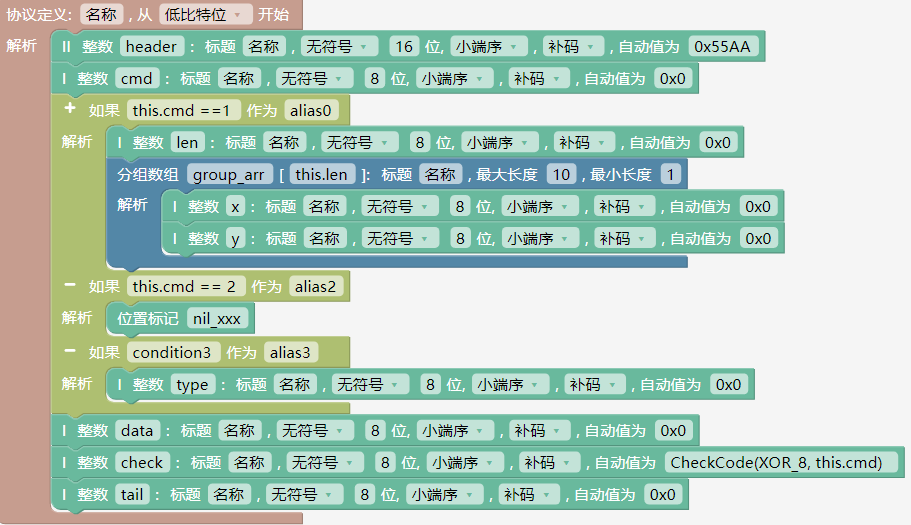
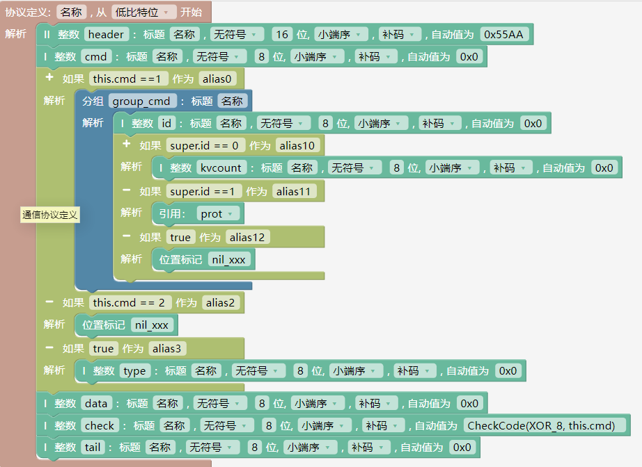
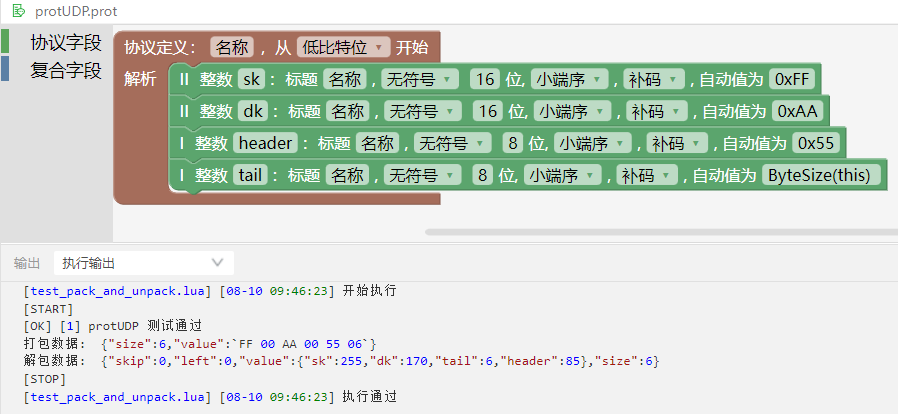
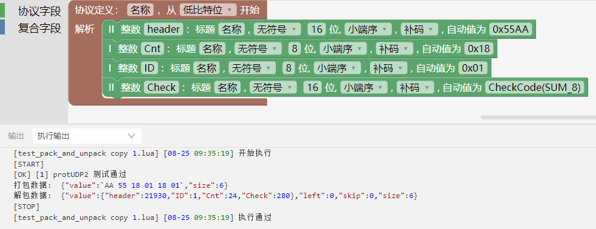
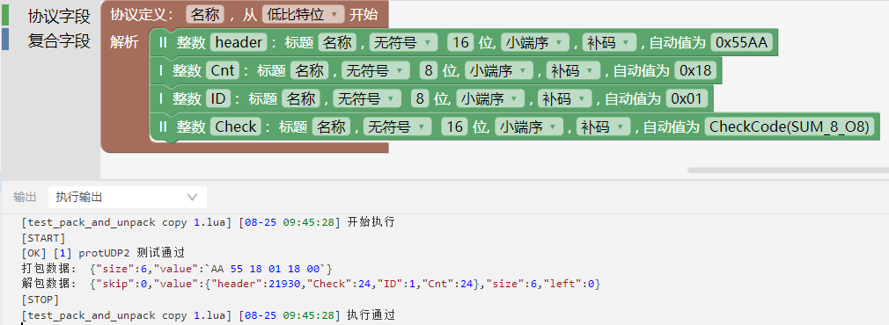
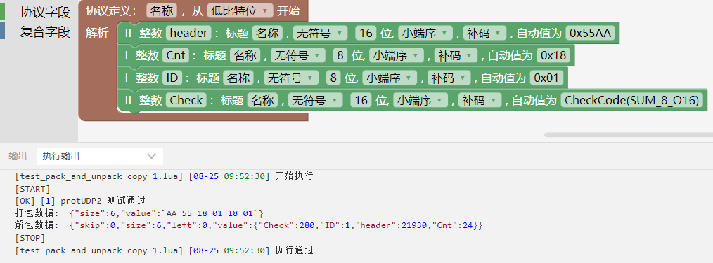
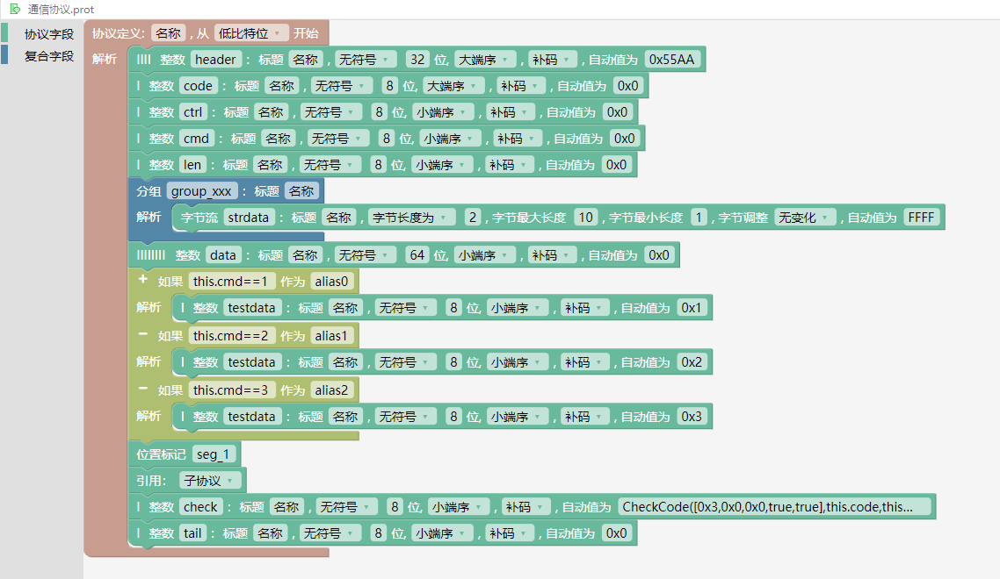
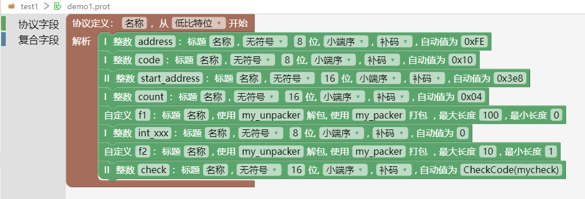

### 协议打包API（pack）

        result = pack(prot,msg)
        功能：根据协议定义，将报文数据打包到数据缓存
        输入参数：
        prot：EProtocol 类型，协议对象
        msg：dict 类型，报文数据
        返回值：
        result：dict 类型，成功返回打包结果，失败返回 nil
        result.value：结果数据缓存
        result.size：打包结果字节长度
        result.prot：打包使用的协议名称
        示例：
        res = pack(protocols.prot3,{data= 100，tail=3})


### 协议解包API（unpack）

        result = unpack(prot,buff,is_auto_shift)
        功能：使用协议定义从数据缓存解析出协议报文数据
        输入参数：
        prot：EProtocol 类型，协议对象。使用时使用“protocols.通信协议文件名称”，.后会进行自动提示项目下所有的通信协议文件名称。当通信协议文件是中文名称时，使用“protocols["协议名称"]”。
        buff：EBuff 类型，数据缓存
        is_auto_shift：boolean 类型，解包成功后是否自动移除使用过的字节，可选参数
        返回值：
        result：dict 类型，解析结果字典
        result.value：报文数据值
        result.size：解包使用的字节长度
        result.prot：解析时使用的协议名称
        result.left：解包完成时还剩余未使用的字节数
        result.skip：开始解析之前忽略的字节数
        result.valid_fail_segs：自动验证失败的协议字段名称
        示例：
        local res = pack(protocols.prot3,{data= 100，tail=3})
        local msg = unpack(protocols.prot3,res.value)

### 协议字段里用到的关键字

- this：表示整个协议对象。    
  

- super: 在分组协议字段里使用，表示分组协议对象。    
  

### 协议内置函数

- 协议内置函数用于协议定义时动态计算或调用内置算法。内置函数包括ByteSize 函数和CheckCode 函数。
  + ByteSize 函数，可以用于计算指定协议字段或协议的长度。接收一个协议字段或协议的引用，返回协议字段或协议的字节长度，ByteSize 只能接收整字节。

  

  + CheckCode 函数，用于计算校验值；接收 3 个参数，依次为校验函数、校验开始协议段、校验结尾协议段。
    + 后两个参数为可选参数，默认从协议第一个协议段开始，至校验字段的前一个协议段结束。
    + 第一个参数有三种赋值方式：内置校验函数名、用户自定义校验函数名或CRC 算法描述方式。

  + 使用8位校验和，进行说明。
    
    1.SUM_8，保留溢出的数据，自动验证使用SUM_8。当求出的校验和大小超过1个字节能表示的最大值255时，溢出的数据保留。

          如下图所示，8位校验和是280，大于255。由于SUM_8函数可以保留溢出的数据，因此协议字段Check的值是280。
      
  

    2.SUM_8_O8，保留低8位，自动验证使用SUM_8_O8。当求出的校验和大小超过1个字节能表示的最大值255时，只保留低8位。

        如下图所示，8位校验和是280，大于255。由于SUM_8_O8函数只保留低8位，因此协议字段Check的值是24。
      
  

    3.SUM_8_O16，保留低16位，自动验证使用SUM_8_O16。求出的校验和只保留低16位。

          如下图所示，8位校验和是280，大于255。由于SUM_8_O16函数保留低16位，因此协议字段Check的值是280。
      
  

    4.SUM_8_O32，保留低32位，自动验证使用SUM_8_O32。求出的校验和只保留低32位。

  更多的校验函数使用，请查看下面的列表。

    + 普通校验函数

    |名称|说明|
    |:---:|:---:|
    | SUM_8 |  8 位校验和，保留溢出的数据 |
    | SUM_8_O8 |  8 位校验和，保留低8位 |
    | SUM_8_O16|  8 位校验和, 保留低16位 |
    | SUM_8_O32 |  8 位校验和，保留低32位 |
    | XOR_8 | 8  位异或值 |
    |SUM_16 |16 位校验和，低字节在前，高字节在后|
    |SUM_16_O16 |16 位校验和，低字节在前，高字节在后, 保留低16位|
    |SUM_16_O32 |16 位校验和，低字节在前，高字节在后, 保留低32位|
    |SUM_16_FALSE |16 位校验和，高字节在前，低字节在后|
    |XOR_16 |16 位异或值，低字节在前，高字节在后|
    |XOR_16_FALSE| 16 位异或值，高字节在前，低字节在后|
    |SUM_32 |32 位校验和，低字节在前，高字节在后|
    |SUM_32_O32 |32 位校验和，低字节在前，高字节在后, 保留低32位|
    |SUM_32_FALSE |32 位校验和，高字节在前，低字节在后|
    |XOR_32 |32 位异或值，低字节在前，高字节在后|
    |XOR_32_FALSE |32 位异或值，高字节在前，低字节在后|

+ CRC 算法描述使用数组的方式描述 CRC 算法，数组前 3 个值为数字，后 2 个值为布尔值，依次为 [多项式值，CRC 初始值，结果异或值，是否反转输入，是否反转输出]（具体内容参考循环冗余校验函数介绍）。

  + 使用CRC算法 CRC_4_ITU 进行举例，如下图所示。

      

  更多的CRC 算法查看如下列表。    
    + 循环冗余校验函数

    |名称|多项式|初始值|结果异或值|反转输入|反转输出|
    |:---:|:---:|:---:|:---:|:---:|:---:|
    |CRC_4_ITU|  0x3| 0x0| 0x0| true| true|
    |CRC_5_EPC| 0x09 |0x09 |0x00 |false |false|
    |CRC_5_ITU| 0x15 |0x00 |0x00 |true |true|
    |CRC_5_USB|0x05 |0x1F |0x1F |true |true|
    |CRC_6_ITU| 0x03| 0x00 |0x00 |true |true|
    |CRC_6_CDMA2000A|0x27| 0x3F| 0x00 |false| false|
    |CRC_6_CDMA2000B|0x07| 0x3F| 0x00 |false |false|
    |CRC_7 |0x09| 0x00| 0x00 |false| false|
    |CRC_8 |0x07| 0x00| 0x00| false| false|
    |CRC_8_EBU |0x1D |0xFF| 0x00 |true |true|
    |CRC_8_MAXIM |0x31| 0x00| 0x00| true |true|
    |CRC_8_WCDMA |0x9B| 0x00| 0x00| true |true|
    |CRC_10 |0x233| 0x000 |0x000| false| false|
    |CRC_10_CDMA2000|0x3D9| 0x3FF| 0x000| false| false|
    |CRC_11 |0x385 |0x01A| 0x000 |false |false|
    |CRC_12_CDMA2000|0xF13|0xFFF| 0x000 |false| false|
    |CRC_12_DECT|0x80F|0x000|0x000|false|false|
    |CRC_12_UMTS|0x80F|0x000|0x000|false|true|
    |CRC_13_BBC|0x1CF5|0x0000|0x0000|false|false|
    |CRC_15|0x4599|0x0000|0x0000|false|false|
    |CRC_15_MPT1327|0x6815|0x0000|0x0001|false|false|
    |CRC_16_ARC|0x8005|0x0000|0x0000|true|true|
    |CRC_16_BUYPASS|0x8005|0x0000|0x0000|false|false|
    |CRC_16_CCITTFALSE|0x1021|0xFFFF|0x0000|false|false|
    |CRC_16_CDMA2000|0xC867|0xFFFF|0x0000|false|false|
    |CRC_16_CMS|0x8005|0xFFFF|0x0000|false|false|
    |CRC_16_DECTR|0x0589|0x0000|0x0001|false|false|
    |CRC_16_DECTX|0x0589|0x0000|0x0000|false|false|
    |CRC_16_DNP|0x3D65|0x0000|0xFFFF|true|true|
    |CRC_16_GENIBUS|0x1021|0xFFFF|0xFFFF|false|false|
    |CRC_16_KERMIT|0x1021|0x0000|0x0000|true|true|
    |CRC_16_MAXIM|0x8005|0x0000|0xFFFF|true|true|
    |CRC_16_MODBUS|0x8005|0xFFFF|0x0000|true|true|
    |CRC_16_T10DIF|0x8BB7|0x0000|0x0000|false|false|
    |CRC_16_USB|0x8005|0xFFFF|0xFFFF|true|true|
    |CRC_16_X25|0x1021|0xFFFF|0xFFFF|true|true|
    |CRC_16_XMODEM|0x1021|0x0000|0x0000|false|false|
    |CRC_17_CAN|0x1685B|0x00000|0x00000|false|false|
    |CRC_21_CAN|0x102899|0x000000|0x000000|false|false|
    |CRC_24|0x864CFB|0xB704CE|0x000000|false|false|
    |CRC_24_FLEXRAYA|0x5D6DCB|0xFEDCBA|0x000000|false|false|
    |CRC_24_FLEXRAYB|0x5D6DCB|0xABCDEF|0x000000|false|false|
    |CRC_30|0x2030B9C7|0x3FFFFFFF|0x00000000|false|false|
    |CRC_32|0x04C11DB7|0xFFFFFFFF|0xFFFFFFFF|true|true|
    |CRC_32_BZIP2|0x04C11DB7|0xFFFFFFFF|0xFFFFFFFF|false|false|
    |CRC_32_C|0x1EDC6F41|0xFFFFFFFF|0xFFFFFFFF|true|true|
    |CRC_32_MPEG2|0x04C11DB7|0xFFFFFFFF|0x00000000|false|false|
    |CRC_32_POSIX|0x04C11DB7|0x00000000|0xFFFFFFFF|false|false|
    |CRC_32_Q|0x814141AB|0x00000000|0x00000000|false|false|
    |CRC_40_GSM|0x0004820009|0x0000000000|0xFFFFFFFFFF|false|false|
    |CRC_64|0x42F0E1EBA9EA3693|0x0000000000000000|0x0000000000000000|false|false|


### 自定义函数

当内置的协议类型无法满足需求时，可以通过编写自定义函数的方式实现自定义打包、解包和校验值计算。


#### 自定义打包、自定义解包、自定义校验

- 自定义协议段的打包函数、解包函数、校验函数，文件名必须是`.custom.lua`,并且该文件必须放在项目的根目录下，示例代码如下： 

  ```lua
      function entry()   -- 入口函数
          ecustom.register_packer("my_packer", my_packer) --注册自定义打包函数
          ecustom.register_unpacker("my_unpacker", my_unpacker) -- 注册自定义解包函数
          ecustom.register_checker("mycheck", mycheck) -- 注册自定义校验函数
      end

      function my_packer(bytes) --参数为协议段的值，返回打包后的字节流
          local bytes = string.pack("f",bytes)
          local res = string.char(string.byte(bytes, 2,2), string.byte(bytes, 1,1), string.byte(bytes, 4,4), string.byte(bytes, 3,3))
            return res
      end

      function my_unpacker(bytes, len) --参数依次为待解包的原始字节流与长度，返回值依次为解析得到的值, 解析使用的字节长度，失败返回nil与-1
          local res = string.char(string.byte(bytes, 2,2), string.byte(bytes, 1,1), string.byte(bytes, 4,4), string.byte(bytes, 3,3))
          local f = string.unpack("f",res)
          return f, #res
      end

      function mycheck(bytes, len) --参数依次为待校验的原始字节流与长度,返回校验结果
        local res = 0
        for i=1, #bytes do
            res = res + string.byte(bytes, i)
        end
        return res
      end
  ```
- 自定义协议段的打包函数、解包函数、校验函数编写示例

  