### 协议定义

协议定义里添加的所有图形化字段，在测试执行过程中，进行打包操作的时候，会按照相应字段的规则转换成报文数据。

- 协议定义名称

  + 是协议的中文名称，便于显示和理解。类似字段的“标题”。
  + 在【界面】功能里使用时，会显示出协议名称，便于用户理解。

- 从“低比特位”开始

  读取数据的方式是从低比特位开始（详情参见[术语](#/document?catalogId=27&id=32&type=doc)部分）。

- 从“高比特位”开始

  读取数据的方式是从高比特位开始（详情参见[术语](#/document?catalogId=27&id=32&type=doc)部分）。

- “|”含义    

  “|”代表该字段的长度是1个字节。小于一个字节长度用“.”表示，2个字节长度用“||”表示，以此类推，几个字节就用几个“|”表示。协议数组字段不做乘法长度的展示。

- 鼠标移动到任意字段上时，会出现悬浮提示说明。

### 协议字段、复合字段列表

- 协议字段

  鼠标点击协议文件界面内的“协议字段”后，展开显示协议字段的字段列表。列表包括整数、整数数组、浮点数、浮点数组、字节流、字节流数组、自定义、位置标记、引用。

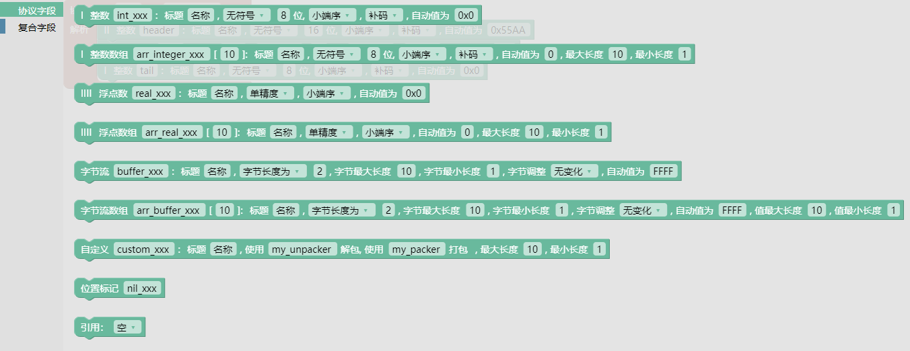

- 复合字段

  鼠标点击协议文件界面内的“复合字段”后，展开显示复合字段的字段列表。列表包括分组、分组数组、分支、区间操作。

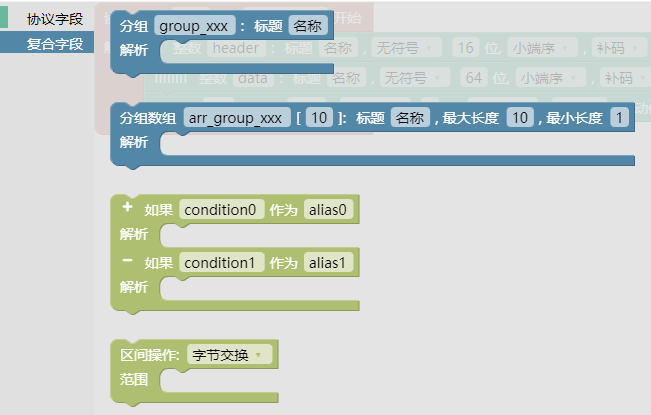

### 协议字段、复合字段添加

图形化协议的编辑是以拖拽拼接方式来添加协议字段和复合字段的。

- 添加协议字段    
  协议字段列表页面，鼠标选中协议字段，拖动协议字段到“协议定义”区域内(字段没有拖动到“协议定义”区域内，则该字段没有添加到该协议文件内，保存文件后关闭文件再打开，该字段已被删除)，拖动不同的协议字段组合在一起，完成通信协议的添加。

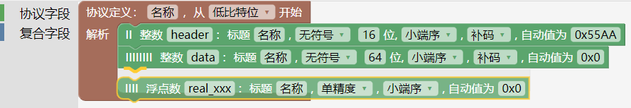

- 拖动协议字段    
  选中协议字段，可拖动该字段及以下字段。  

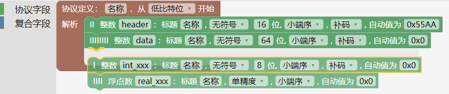

- 添加复合字段    
  复合字段列表页面，鼠标选中复合字段，拖动复合字段到“协议定义”区域内对应的协议位置，复合字段添加成功。

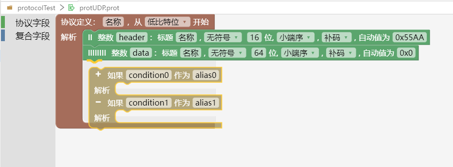
- 协议字段和复合字段组合    
将协议字段拖拽到复合字段内的对应区域，实现复合字段与协议字段的配合使用。

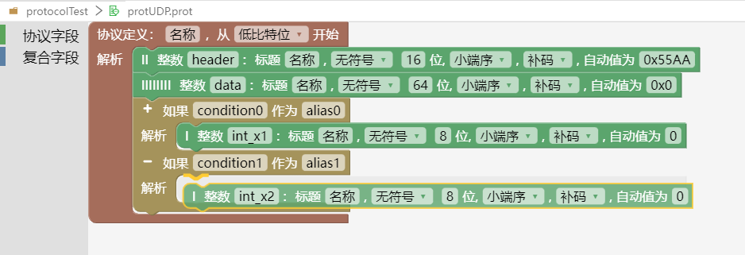

### 协议字段详情

- 整数
  + 类型：整数字段类型是int。
  + 命名：字段名需要符合变量命名规范(由英文字母、下划线_或数字组成,并且第一个字符必须是英文字母或下划线,不能使用关键字)，同一个协议内的字段名称不能重复。
  + 标题：输入有意义的标题名称，在【界面】里使用时，会显示出标题名称，便于用户理解。
  + 有符号、无符号（详情参见[术语](#/document?catalogId=27&id=32&type=doc)部分）。
  + 位：规定了数据的长度，默认是8个bit位（详情参见[术语](#/document?catalogId=27&id=32&type=doc)部分）。
  + 小端序、大端序（详情参见[术语](#/document?catalogId=27&id=32&type=doc)部分）。
  + 补码、反码、原码（详情参见[术语](#/document?catalogId=27&id=32&type=doc)部分）。
  + 自动值（详情参见[术语](#/document?catalogId=27&id=32&type=doc)部分）。

  示例：编辑如图所示的通信协议文件，在测试执行中的打包数据结果和解包数据结果，如图所示。

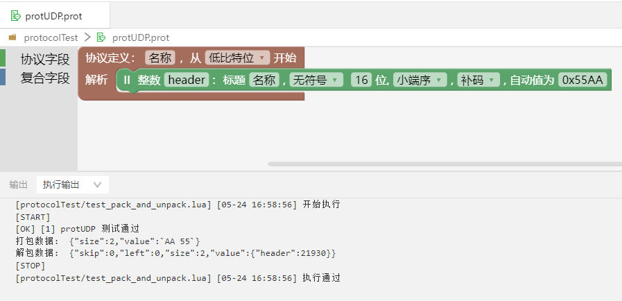

- 整数数组
  + 类型：整数数组字段类型是int。
  + 命名：字段名需要符合变量命名规范(由英文字母、下划线_或数字组成,并且第一个字符必须是英文字母或下划线,不能使用关键字)，同一个协议内的字段名称不能重复。
  + 整数数组的数组长度：规定了整数数组里的数组长度，默认是10。数值可以为常数、协议段引用或计算表达式。该数值与配置的位数结合使用，来规定整个字段的长度。如果此处输入10，位输入8，则整个字段的长度是10个字节。
  + 标题：输入有意义的标题名称，在【界面】里使用时，会显示出标题名称，便于用户理解。
  + 有符号、无符号（详情参见[术语](#/document?catalogId=27&id=32&type=doc)部分）。
  + 位：规定了数组中每一个元素的长度（详情参见[术语](#/document?catalogId=27&id=32&type=doc)部分）。
  + 小端序、大端序（详情参见[术语](#/document?catalogId=27&id=32&type=doc)部分）。
  + 补码、反码、原码（详情参见[术语](#/document?catalogId=27&id=32&type=doc)部分）。
  + 自动值（详情参见[术语](#/document?catalogId=27&id=32&type=doc)部分）。
  + 最大长度：规定了字段的最大长度。如果数组的数组长度输入了固定数值，那么最大长度设置就不起作用；如果数组的数组长度输入的是动态引用时，最大长度设置才起作用。
  + 最小长度：规定了字段的最小长度。

  示例：编辑如图所示的通信协议文件，在测试执行中的打包数据结果和解包数据结果，如图所示。

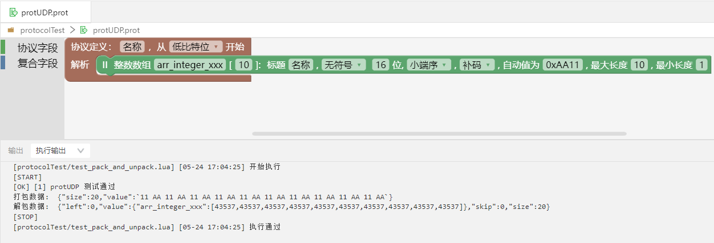

- 浮点数

  + 类型：字段设置为单精度时，类型是float,字段设置为双精度时，类型是double。
  + 命名：字段名需要符合变量命名规范(由英文字母、下划线_或数字组成,并且第一个字符必须是英文字母或下划线,不能使用关键字)，同一个协议内的字段名称不能重复。
  + 标题：输入有意义的标题名称，在【界面】里使用时，会显示出标题名称，便于用户理解。
  + 单精度、双精度（详情参见[术语](#/document?catalogId=27&id=32&type=doc)部分）。
  + 小端序、大端序（详情参见[术语](#/document?catalogId=27&id=32&type=doc)部分）。
  + 自动值（详情参见[术语](#/document?catalogId=27&id=32&type=doc)部分）。

示例：编辑如图所示的通信协议文件，在测试执行中的打包数据结果和解包数据结果，如图所示。

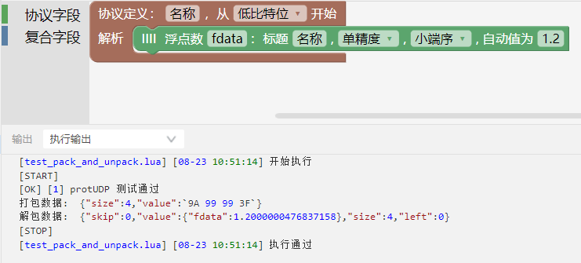

- 浮点数组

  + 类型：字段设置为单精度时，类型是float,字段设置为双精度时，类型是double。
  + 命名：字段名需要符合变量命名规范(由英文字母、下划线_或数字组成,并且第一个字符必须是英文字母或下划线,不能使用关键字)，同一个协议内的字段名称不能重复。
  + 浮点数组的数组长度：规定了浮点数组里的数组长度，默认是10。数值可以为常数、协议段引用或计算表达式。
  + 标题：输入有意义的标题名称，在【界面】里使用时，会显示出标题名称，便于用户理解。
  + 单精度、双精度（详情详情参见[术语](#/document?catalogId=27&id=32&type=doc)部分）。
  + 小端序、大端序（详情参见[术语](#/document?catalogId=27&id=32&type=doc)部分）。
  + 自动值（详情参见[术语](#/document?catalogId=27&id=32&type=doc)部分）。
  + 最大长度：规定了数组的最大长度。如果数组的数组长度输入了固定数值，那么最大长度设置就不起作用；如果数组的数组长度输入的是动态引用时，最大长度设置才起作用。
  + 最小长度：规定了数组的最小长度。

  示例：编辑如图所示的通信协议文件，在测试执行中的打包数据结果和解包数据结果，如图所示。

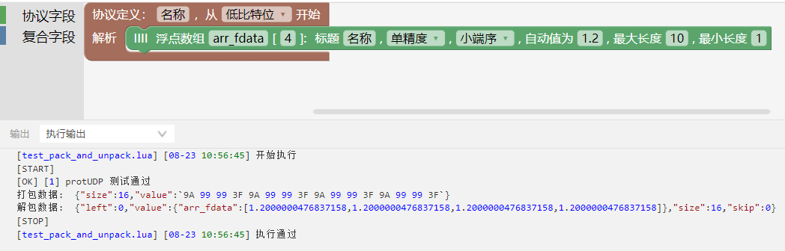

- 字节流（详情参见[术语](#/document?catalogId=27&id=32&type=doc)部分）。

  + 命名：字段名需要符合变量命名规范(由英文字母、下划线_或数字组成,并且第一个字符必须是英文字母或下划线,不能使用关键字)，同一个协议内的字段名称不能重复。
  + 标题：输入有意义的标题名称，在【界面】里使用时，会显示出标题名称，便于用户理解。
  + 字节长度为：字节的长度，默认字节长度是2个字节。自动值数据长度要与该项设置长度一致，不一致时会报错“自动值长度不一致”。
  + 结束符为：用于设置字符串类型协议段的结尾符号。
    + 需要注意：打包时会自动添加结尾符，解包时自动删除结尾符。
  + 字节最大长度：规定了字节的最大长度。
      + 如果“字节长度为”输入固定值，那么字节最大长度设置就不起作用；如果“字节长度为”输入的是动态引用时，字节最大长度设置才起作用。
      + 如果设置的是“结束符为”类型，那么字节最大长度设置要大于“自动值为”输入的数据长度，否则会报错“自动值长度不一致”。
  + 字节最小长度：规定了字节的最小长度。
  + 自动值（详情参见[术语](#/document?catalogId=27&id=32&type=doc)部分）。
  + 注意：协议的字节数一定是整字节，8 个 bit 位为一个字节；协议段设置为字节流时默认值只支持 16 进制字符串不需要 0x，整型的默认值则需要 0x。

示例：编辑如图所示的通信协议文件，设置类型为“字节长度为”，在测试执行中的打包数据结果和解包数据结果，如图所示。

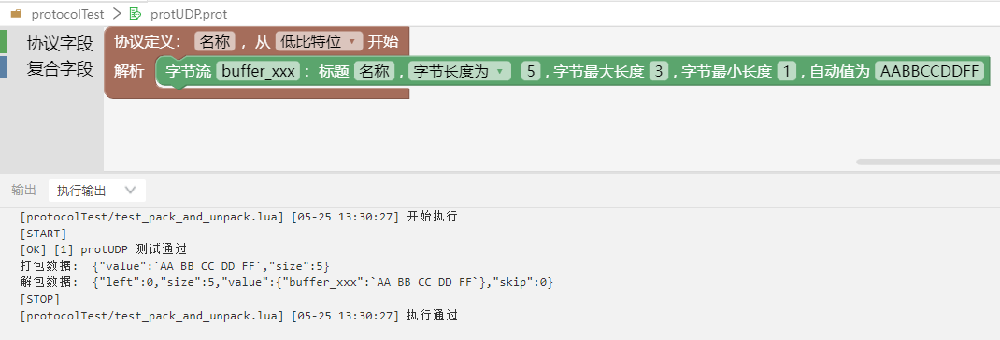

  示例：编辑如图所示的通信协议文件，设置类型为“结束符为”，在测试执行中的打包数据结果和解包数据结果，如图所示。

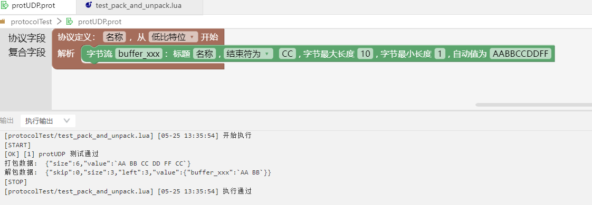

- 字节流数组

  + 命名：字段名需要符合变量命名规范(由英文字母、下划线_或数字组成,并且第一个字符必须是英文字母或下划线,不能使用关键字)，同一个协议内的字段名称不能重复。
  + 字节流数组的数组长度：规定了字节流数组里的数组长度，默认是10。数值可以为常数、协议段引用或计算表达式。
  + 标题：输入有意义的标题名称，在【界面】里使用时，会显示出标题名称，便于用户理解。
  + 字节长度为：字节的长度，默认字节长度是2个字节。自动值数据长度要与该项设置长度一致，不一致时会报错“自动值长度不一致”。
  + 结尾符为：用于设置字符串类型协议段的结尾符号。
      + 需要注意：打包时会自动添加结尾符，解包时自动删除结尾符。
  + 字节最大长度：规定了字节的最大长度。
    + 如果“字节长度为”输入固定值，那么字节最大长度设置就不起作用；如果“字节长度为”输入的是动态引用时，字节最大长度设置才起作用。
    + 如果设置的是“结尾符为”类型，那么字节最大长度设置要大于“自动值为”输入的数据长度，否则会报错“自动值长度不一致”。
  + 字节最小长度：规定了字节的最小长度。
  + 自动值（详情参见[术语](#/document?catalogId=27&id=32&type=doc)部分）。
  + 值最大长度：规定了数组的最大长度。如果数组的数组长度输入了固定数值，那么最大长度设置就不起作用；如果数组的数组长度输入的是动态引用时，最大长度设置才起作用。
  + 值最小长度：规定了数组的最小长度。

  示例：编辑如图所示的通信协议文件，设置类型为“字节长度为”，在测试执行中的打包数据结果和解包数据结果，如图所示。

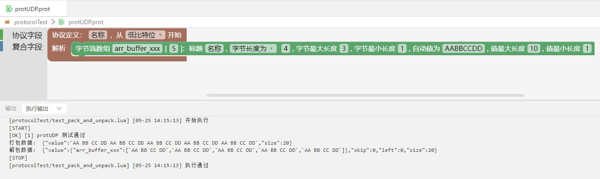

  示例：编辑如图所示的通信协议文件，设置类型为“结尾符为”，在测试执行中的打包数据结果和解包数据结果，如图所示。

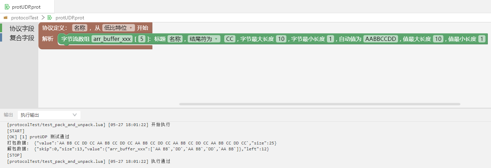

- 自定义

  + 当内置的协议类型无法满足需求时，可以通过编写自定义函数的方式实现自定义打包、解包（具体实现参考下面的自定义打包、自定义解包内容）。
  + 命名：字段名需要符合变量命名规范(由英文字母、下划线_或数字组成,并且第一个字符必须是英文字母或下划线,不能使用关键字)，同一个协议内的字段名称不能重复。
  + 标题：输入有意义的标题名称，在【界面】里使用时，会显示出标题名称，便于用户理解。
  + 使用“my_unpacker”解包：“my_unpacker”可以修改，是自己编写的解包脚本的函数名称。
  + 使用“my_packer”打包：“my_packer”可以修改，是自己编写的打包脚本的函数名称。
  + 最大长度：限制打包、解包使用的字节的最大长度。
  + 最小长度：限制打包、解包使用的字节的最小长度。

  示例：编辑如图所示的通信协议文件，使用自定义打包解包，结果如图所示。  

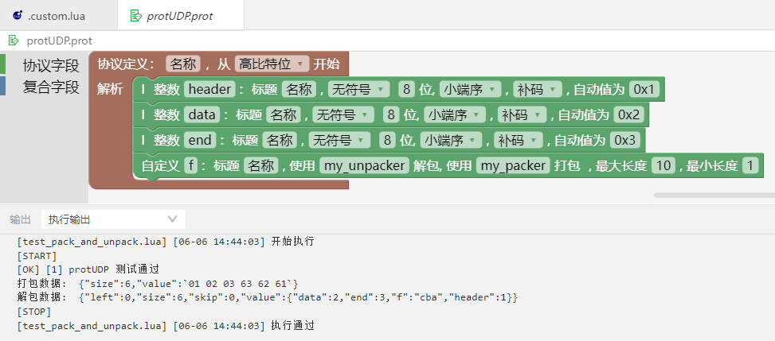

- 位置标记
  + 协议段仅描述名称，而没有任何属性。主要用来标识字节流位置，在解析时将被忽略。
  + 命名：字段名需要符合变量命名规范(由英文字母、下划线_或数字组成,并且第一个字符必须是英文字母或下划线,不能使用关键字)，同一个协议内的字段名称不能重复。

  示例：编辑如图所示的通信协议文件，打包解包结果，如图所示。

  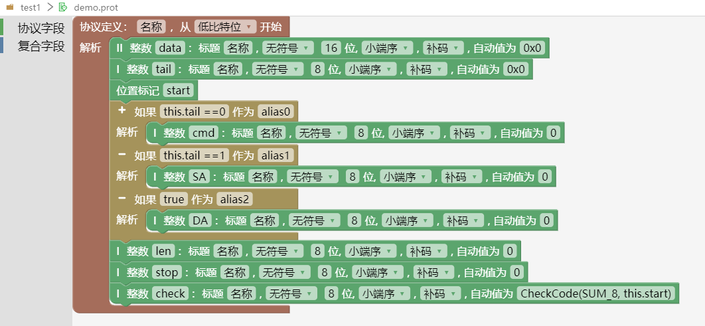

### 复合字段详情

- 分组
  + 将多个协议段组合在一起，并使用相同的父级名称。
  + 命名：字段名需要符合变量命名规范(由英文字母、下划线_或数字组成,并且第一个字符必须是英文字母或下划线,不能使用关键字)，同一个协议内的字段名称不能重复。
  + 标题：输入有意义的标题名称，在【界面】里使用时，会显示出标题名称，便于用户理解。

  示例：编辑如图所示的分组通信协议文件，打包解包结果，如图所示。

  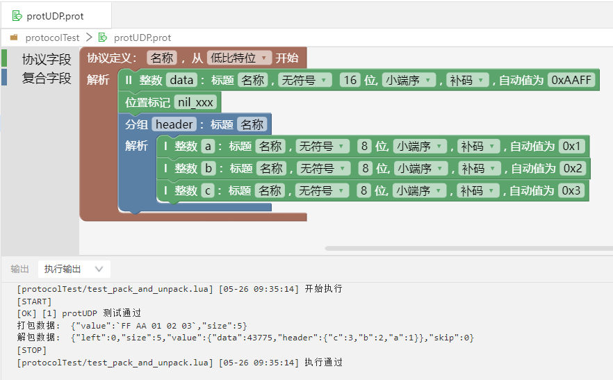

- 分组数组
  + 当需要连续发送多个相同的分组时，可以把这些分组放在数组里。
  + 命名：字段名需要符合变量命名规范(由英文字母、下划线_或数字组成,并且第一个字符必须是英文字母或下划线,不能使用关键字)，同一个协议内的字段名称不能重复。
  + 分组数组的数组长度：默认是10。
  + 标题：输入有意义的标题名称，在【界面】里使用时，会显示出标题名称，便于用户理解。
  + 最大长度：规定了数组的最大长度。如果数组的数组长度输入了固定数值，那么最大长度设置就不起作用；如果数组的数组长度输入的是动态引用时，最大长度设置才起作用。
  + 最小长度：规定了数组的最小长度。

  *注意：分组数组长度或者数组长度中存在ByteSize函数无法解包。

  示例：编辑如图所示的分组数组通信协议文件，打包解包结果，如图所示。

  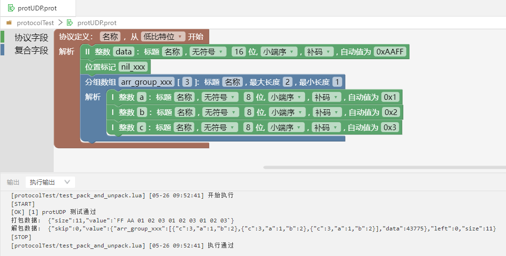

- 分支

  + 类型关键字是 oneof，使用 when 条件语句进行动态判断解析路径，并使用 as 关键字对分支协议定义别名；分支别名不改变协议段的引用方式，仅用于打包、解包的结果描述信息中，用来描述解包、打包时使用的分支。当 when 判定条件计算结果为 true 时，解析器进入该分支内部进行解析，其它分支将被忽略；当 when 判定条件计算结果为 false 时，跳过该分支，继续下一分支条件判断。
  + 图形界面点击“+”，增加一个when条件语句，点击“-”，删除一个when条件语句。
  + 如果“condition0”作为“alias0”满足条件时，执行该条件下的字段。

  示例：编辑如图所示的分支通信协议文件，分支使用了协议段引用（详情参见[术语](#/document?catalogId=27&id=32&type=doc)部分）作为条件，打包解包结果，如图所示。

  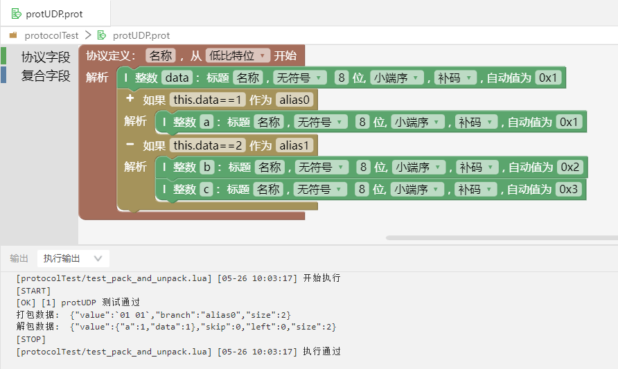
  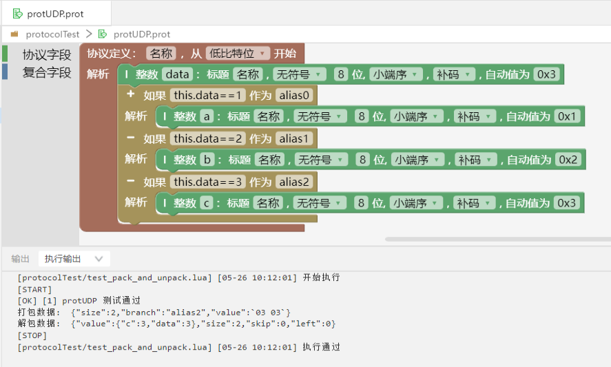

- 区间操作
  + 为了满足复杂的测试需求，在测试过程中需要对数据报文中的相关字节的位置进行交换。
  + 字节交换：2个相邻字节之间两两交换（协议字段必须是双字节，才能进行操作，否则报错。）。

  示例：编辑如图所示的区间操作字节交换通信协议文件，打包解包结果，如图所示。

  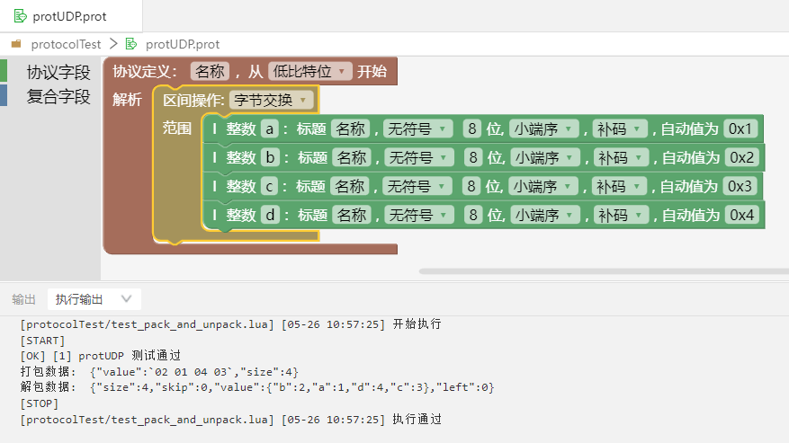

  + 字节反向：全部字节逆序输出。

  示例：编辑如图所示的区间操作字节反向通信协议文件，打包解包结果，如图所示。

  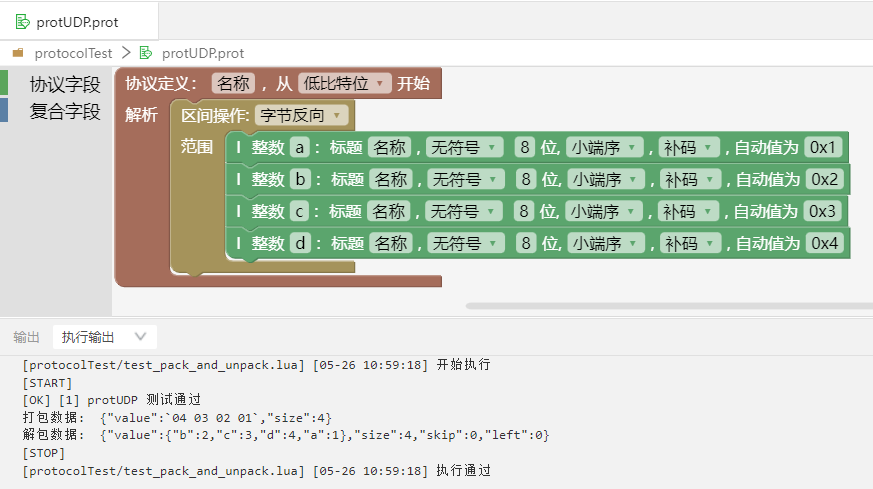

  + 字节反向且交换：全部字节逆序输出后，2个相邻字节之间两两交换（协议字段必须是双字节，才能进行操作，否则报错。）。

  示例：编辑如图所示的区间操作字节反向且交换通信协议文件，打包解包结果，如图所示。

  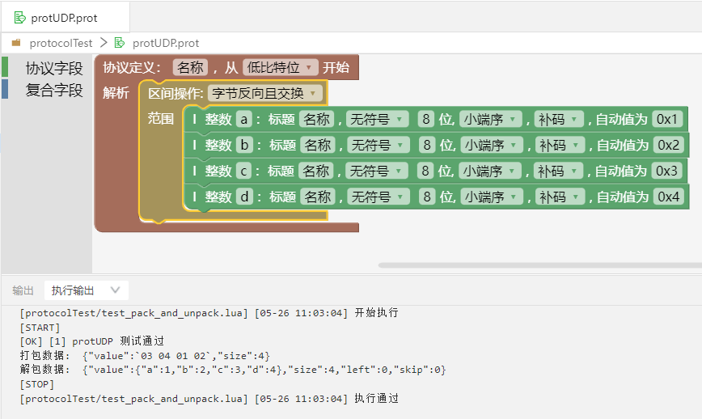

- 引用
  + 可以使用引用字段，将其他协议文件里的协议字段添加到当前文件里，作为当前文件的协议字段使用。

  示例：在当前文件下添加引用字段，如图所示。

  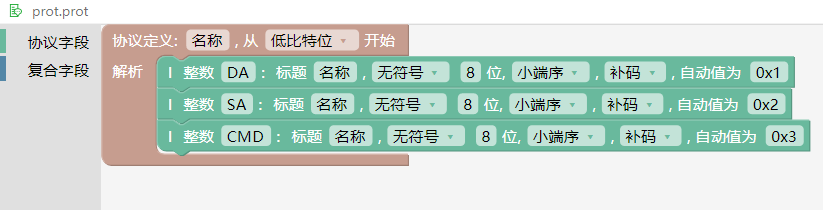
  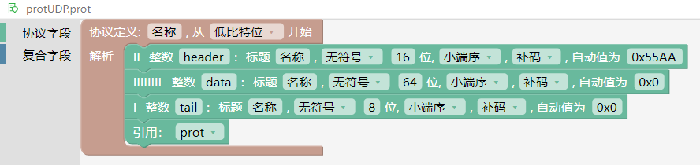