## 通信协议相关术语

### 位
- 位是最小的存储单位，单位是比特（bit）。每一个位存储一个1位的二进制码。
- 通信协议的字节数一定是整字节，通信协议里的每个字段可以不是整字节。

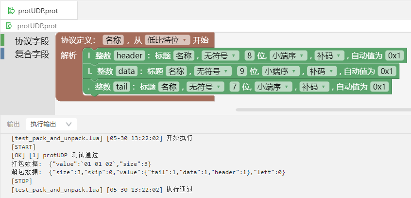

- 8个bit位为一个字节，通信协议不是整字节时，在【执行输出】区域会有错误信息提示。

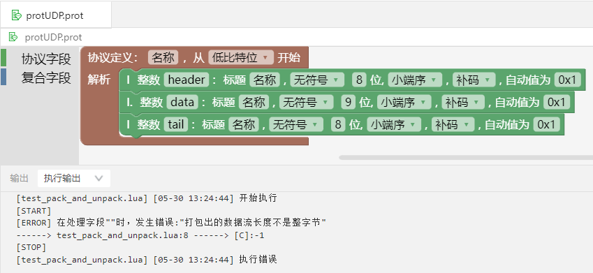

### 十六进制

- 0x是十六进制的前缀；0x0和0x1就是十六进制的0和1，数值上等于十进制的0和1。

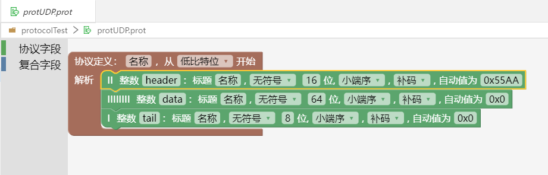

### 高低地址

- 在内存中，多字节对象都是被存储为连续的字节序列。

例如在C语言中，一个类型为int的变量n，如果其存储的首个字节的地址为0x1000，那么剩余3个字节的地址将存储在0x1001~0x1003。总之，不管具体字节顺序是以什么方式排列，内存地址的分配一般是从小到大的增长。我们常把0x1000称为低地址端，把0x1003称为高地址端。

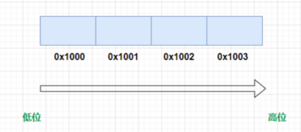

### 高低字节

举例来说明一下高低字节。例如一个int类型的整数123456789，该整数转换为二进制和十六进制时，
视图上从左到右显示是从高字节到低字节。

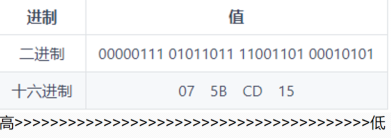

- 最左边的叫高字节，即 0x07

- 最右边的叫低字节，即 0x15

### 大端序、小端序

协议的大端序和小端序是指在数据传输过程中，字节的顺序排列方式。

- 大端序：数据的高位字节存储在内存的低地址处，而低位字节存储在高地址处。也就是说，数据的高位字节先被发送或存储，而低位字节后被发送或存储。
- 小端序：数据的低位字节存储在内存的低地址处，而高位字节存储在高地址处。也就是说，数据的低位字节先被发送或存储，而高位字节后被发送或存储。

举例来说明一下大端序和小端序，例如十六进制的数 0x12345678, 最左边的为高字节 0x12,最右边的为低字节 0x78。

- 如图所示，高字节放低地址，低字节放高地址，即是大端序，先发送或存储高位字节，后发送或存储低位字节。

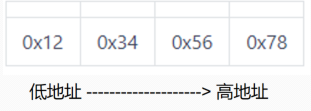

- 如图所示，低字节放低地址，高字节放高地址，即是小端序，先发送或存储低位字节，后发送或存储高位字节。

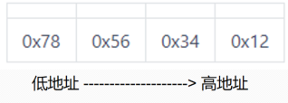

### 高低比特位开始

- bitrl： 低bit位开始，指定协议内协议段的位序为从右至左。
- bitlr： 高bit位开始，指定协议内协议段的位序为从左至右。

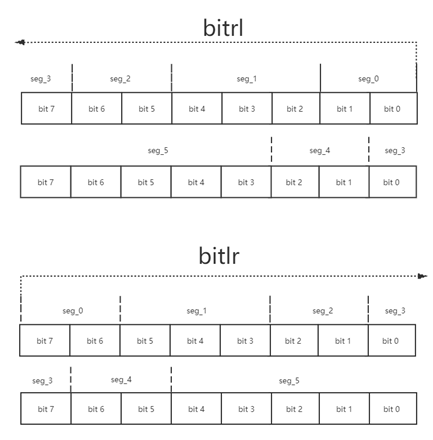

以数字0xB4（10110100）为例，用图加以说明。

高比特位开始：

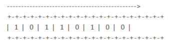

低比特位开始：

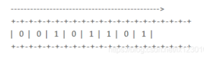

### 有符号、无符号

- 有符号：有符号数（signed number）,用最高位作为符号位，“0”代表“+”，“1”代表“-” ；其余数位用作数值位，代表数值。

- 无符号：无符号数（Unsigned number）是相对于有符号数而言的，指的是整个机器字长的全部二进制位均表示数值位，相当于数的绝对值。

### 补码、反码、原码

- 补码（&）：使用补码可以将符号位和其它位统一处理，同时减法也可按加法来处理。另外，两个用补码表示的数相加时，如果最高位（符号位）有进位，则进位被舍弃。

- 反码（!）：正数的反码就是其原码；负数的反码是将原码中，除符号位以外每一位取反。

- 原码（=）：原码表示法在数值前面增加了一位符号位(即最高位为符号位):正数该位为0，负数该位为1，其余位表示数值的大小。

- 三者之间的转换方法：

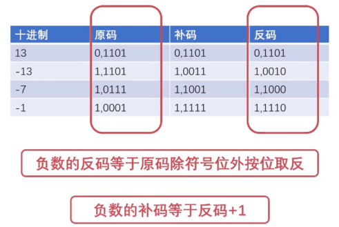

### 自动值

- 当报文数据打包时，如果对应协议段的值为空，则自动使用 autovalue 属性值打包。如果对应协议段已经赋值，该属性会被忽略。autovalue 属性值可以设置为常量、数组、协议段引用、内置函数调用或计算表达式。

### 通信协议打包

- 通信协议打包是指将要发送的数据按照特定的通信协议格式进行编码，以便于在网络中传输和解析。通常，通信协议打包需要遵循特定的协议规范，以确保数据能够被正确地传输和解析。
- 在打包通信协议时，需要根据协议规范定义数据包的格式和字段。通常，一个数据包由包头和包体两部分组成。包头用于标识数据包的类型、长度等信息，而包体则包含了要传输的数据。在打包时，需要按照协议规范对包头和包体进行编码，并将它们组合成一个完整的数据包。

### 通信协议解包

- 通信协议解包是指在接收到数据后，按照特定的通信协议格式进行解码，以便于对数据进行处理和使用。通常，通信协议解包需要遵循特定的协议规范，以确保数据能够被正确地解析和使用。
- 在解包通信协议时，需要根据协议规范对接收到的数据进行解码，并将其拆分成包头和包体两部分。包头用于标识数据包的类型、长度等信息，而包体则包含了要传输的数据。在解包时，需要按照协议规范对包头和包体进行解码，并将它们组合成一个完整的数据包。

### 单精度、双精度

- 单精度(float类型)和双精度(double类型)的区别如下：    
  + 在内存中占有的字节数不同：单精度浮点数在机内占4个字节，双精度浮点数在机内占8个字节。    
  + 有效数字位数不同：单精度浮点数有效数字7位，双精度浮点数有效数字16位。    
  + 所能表示数的范围不同：单精度浮点的表示范围：-3.40E+38 ~ +3.40E+38，双精度浮点的表示范围：-1.79E+308 ~ +1.79E+308。
  + 在程序中处理速度不同：一般CPU处理单精度浮点数的速度比处理双精度浮点数快。    

### 字节流

- 字节流是指传输过程中，传输数据的最基本单位是字节的流，一个不包含边界数据的连续流。字节流是由字节组成的，主要用在处理二进制数据。

### 协议段引用

- 协议段属性赋值时可以使用 “this.协议段名称” 的方式来引用其它协议段；在计算表达式中使用协议段引用时，等同于使用对应协议段的值。

