## 通信协议

通信协议是指双方实体完成通信或服务所必须遵循的规则和标准。它定义了通信双方之间的数据交换格式、通信方式、错误处理等方面的细节。本系统内的通信协议是通信的数据包的格式定义。设备进行通信时，都要按照一定的协议进行数据的组织，就需要使用协议进行打包和解包(详情参见[术语](#/document?catalogId=27&id=32&type=doc)）。测试脚本进行数据接收和发送的时候，配合使用协议进行数据解析，能够快速完成测试操作。通信协议文件提供图形化的代码块进行编辑，方便用户的理解和操作。

### 通信协议新建

通信协议文件是以“.prot”为扩展名结尾的文件。

- 鼠标选中对应的文件夹->鼠标右键选择【新建文件】->选择【通信协议】

- 界面顶部弹出文件名输入框->输入文件名称->确认回车(Enter键)

- 通信协议文件新建成功，默认添加3条整数字段，附加属性默认隐藏(点击界面右侧“<<”图标后展开显示附加属性）。

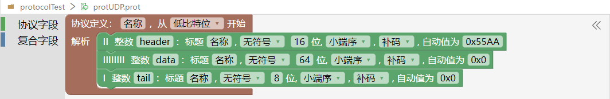

### 垃圾桶临时删除功能

  + 在通信协议文件编辑页面，未关闭文件前，可以通过垃圾桶删除功能临时删除字段或者恢复字段。当关闭文件后，垃圾桶内的字段将彻底删除。
  + 鼠标选中一条或多条字段，拖拽到右下角的垃圾桶图标内，可以删除字段。
  + 点击垃圾桶，会显示已删除的代码块，可拖动到协议编辑区域进行恢复。

  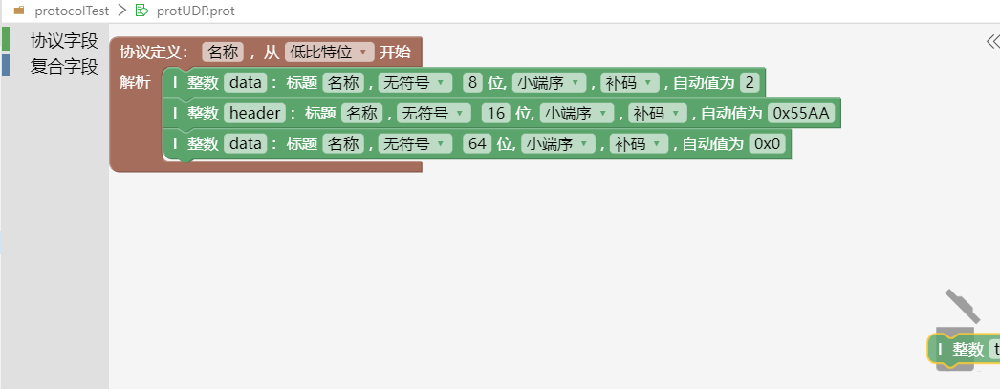
  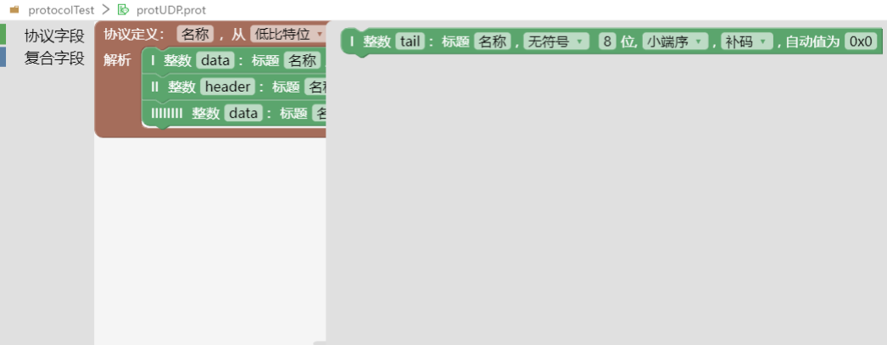

### 操作菜单
  - 鼠标选中代码块，鼠标右键弹出操作菜单，可以进行折叠块、复制、剪切、粘贴、删除操作。
    + 鼠标选中代码块后，按住shift 多选或者按住shift拖拽画方框进行多选。
    + 鼠标选中代码块后，按住Ctrl，进行点选。
  - 鼠标选中空白区域，鼠标右键弹出操作菜单，可以进行撤销、重做、折叠块、展开块、全选操作。

  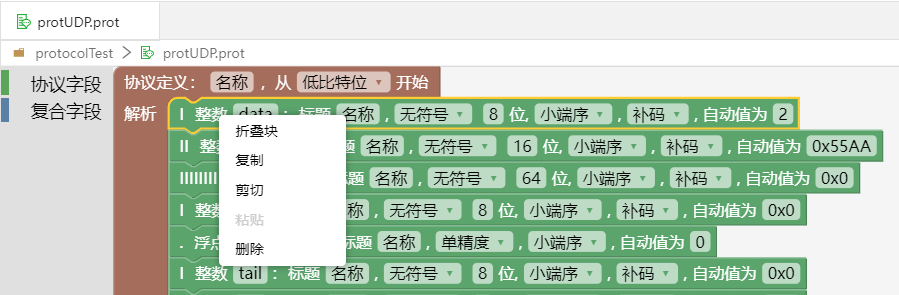
  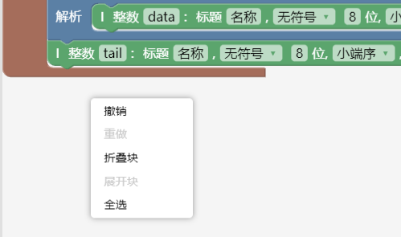

### 快捷键操作
  + Delete：鼠标选中字段，按下Delete键，删除选中的字段。
  + ctrl+c：进行复制操作。
  + ctrl+v：进行粘贴操作。
  + ctrl+x：进行剪切操作。
  + ctrl+z：撤销上一次的操作。
  + ctrl+y：恢复上一次的操作。
  + 双击：协议字段、复合字段上双击，折叠块。

### 跨文件复制
  + 支持跨项目、跨文件复制粘贴。

### 转为Yaml

- 通信协议文件页面，点击右上角的“转化”，选择“转为Yaml”，该通信协议文件会以yaml文件形式存在，文件内的字段名称和内容与图形化的通信协议一致。
- 作用：当有大量的通信协议字段需要进行添加编辑时，使用yaml格式的文件操作更加方便。使用yaml文件协议添加编辑后，可以通过yaml页面的“转化”-“转为图形”操作，转为通信协议类型文件。

  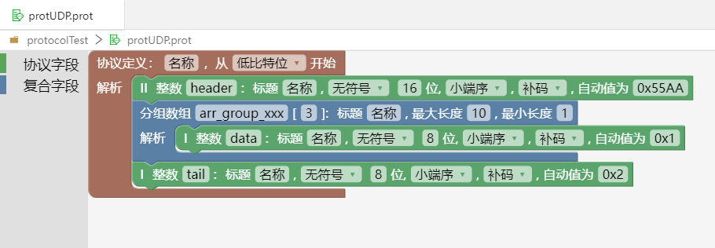
  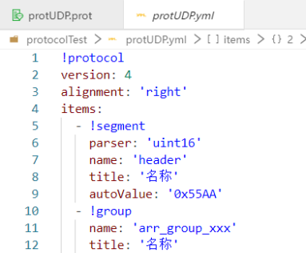

### 导入xml

- 作用：选择xml文件导入生成prot和yaml类型的通信协议，在系统内使用。
- 通信协议文件页面，点击右上角的“导入xml”，选择xml文件确认后，生成对应的prot和yaml类型的通信协议。

xml文件格式如图所示：

  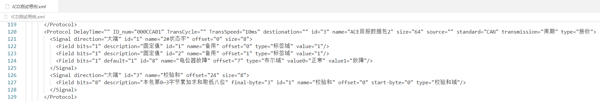 

  导入成功后，生成的prot文件如图所示：

  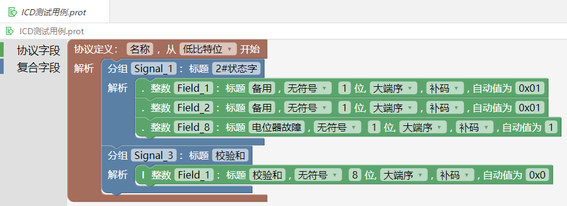

  导入成功后，生成的yml文件如图所示：

  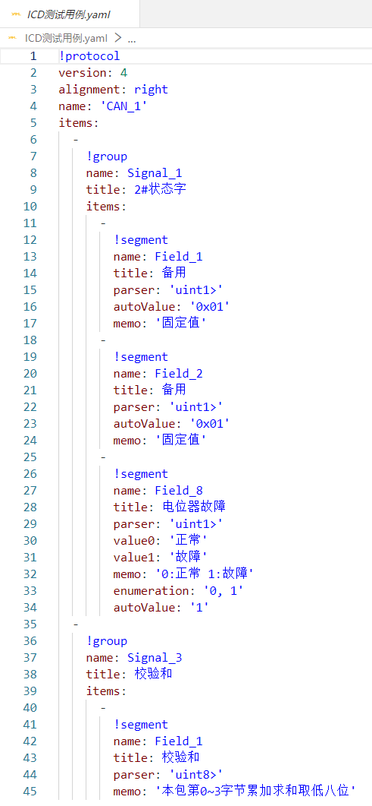

### 复制默认值

- 作用：是复制通信协议内容后粘贴到yaml文件，作为测试用例使用。
- 通信协议文件页面，点击右上角的“复制默认值”，新建一个yaml文件，进行粘贴。

   
  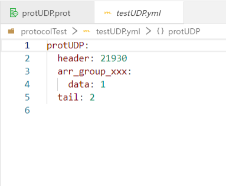

### 放大、缩小、还原

- 作用：可以点击放大、缩小、还原按钮，对通信协议字段的显示进行缩放。
- 点击“放大”按钮，通信协议字段整体放大显示；点击“缩小”按钮，通信协议字段整体缩小显示；点击“显示100%”按钮，通信协议字段显示还原到初始大小。