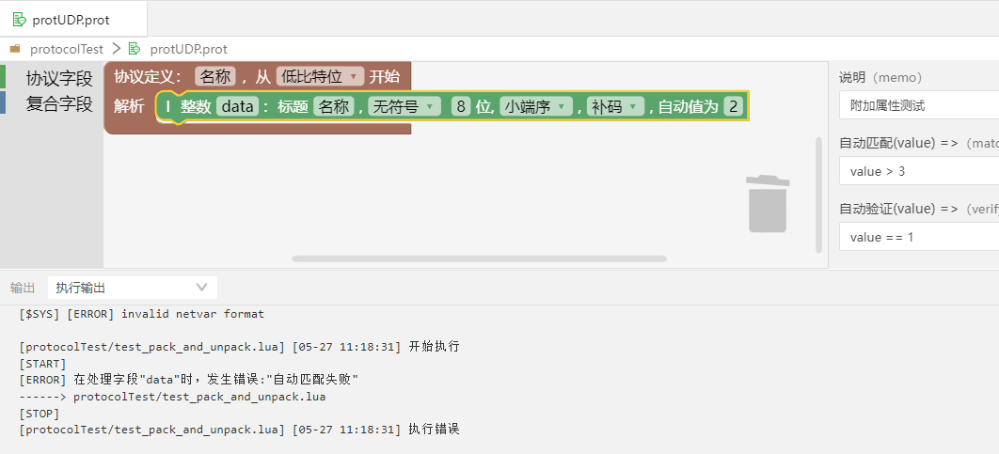
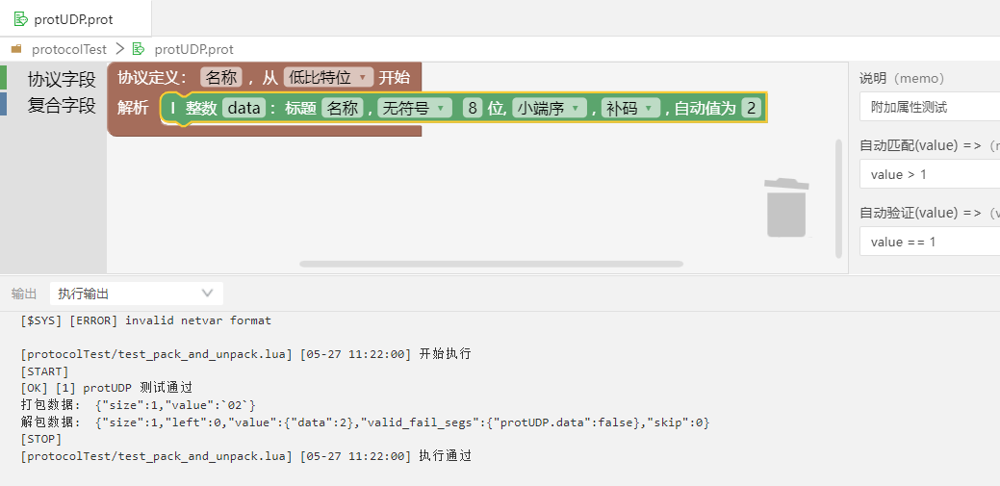
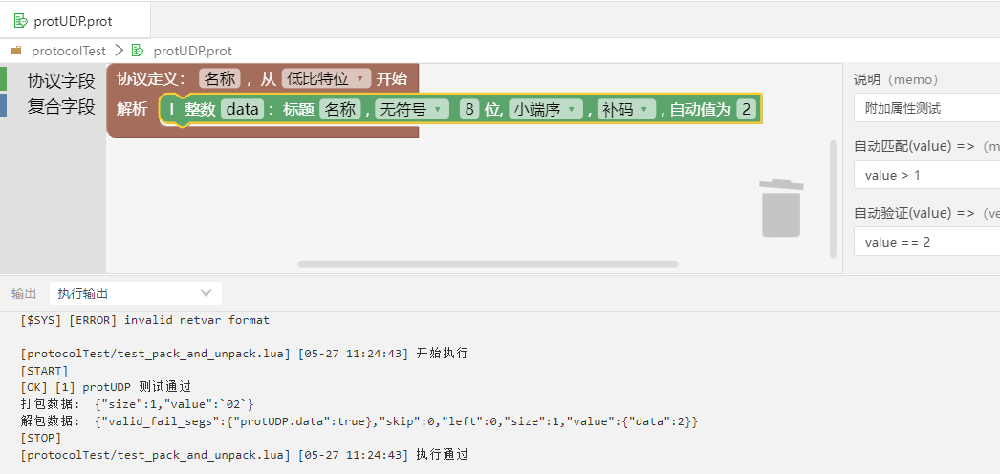

## 附加属性

- 只有整数、整数数组、浮点数、浮点数组，有附加属性，其他协议字段和复合字段没有附加属性。    
- 打开通信协议文件，点击界面右上角的“<<”图标，打开附加属性编辑界面。

  + 说明（memo）：协议的描述。
  + 最高位（MSB,Most Significant bit）：标识最高有效位。当需要对最高位做一个标记时，编辑该内容。该内容只是对最高有效位做一个说明描述，不使用在实际的打包和解包中。
  + 最低位（LSB,Least Significant bit）：标识最低有效位。当需要对最低位做一个标记时，编辑该内容。该内容只是对最低有效位做一个说明描述，不使用在实际的打包和解包中。
  + 自动匹配(value)=>(match)：支持解析过程中的无效数据过滤。一般用于过滤报头前的冗余字段，找到报头后才开始解析。即是找到合格的数据包后再开始解析，自动跳过不匹配的字节，解析结果中会提示跳过了几个字节。点击“使用自动值进行匹配”后，自动输入匹配内容。

    示例：当不符合匹配规则时，会报错“自动匹配失败”，如图所示。

  

    示例：当符合匹配规则时，执行通过，如图所示。

  

  + 自动验证(value)=>(verify)：支持自定义解析结果正确性验证。自动验证是用来解包后自动断定结果是否合格，对字段的功能正确性进行验证。即是解包后自动判定结果是否合格，比如自动验证表达式为value == 1，则解包后会自动判定本协议段的值是否满足表达式，如果不满足结果中会有记录。点击“使用自动值进行验证”后，自动输入验证内容。

    示例：当不符合自动验证规则时，"valid_fail_segs"结果是false，如图所示。

  

    示例：当符合自动验证规则时，"valid_fail_segs"结果是true，如图所示。

  

  + 打包前转换表达式：内容是一个表达式。根据输入的表达式，对协议字段进行加减乘除等的换算，打包时使用换算后的值进行打包。如：字段len自动值是1，内容输入"value + 5"，则打包时len使用的值是6。

  + 类别(catalog)：协议段的类别，相当于给协议段打了一个标签，包括包头、包尾、数据、校验、标识、长度。设置不同的类别后，在“快速测试”功能选择该通信协议时，只有数据类别的字段默认选中，进行数据发送和接收的测试。
  + 显示格式(format)：包括默认、16进制、10进制。设置不同的格式后，会在“快速测试”功能里显示对应的设置格式。
  + 最小值(min)：协议段的最小值。用于提供给【组合对模型】-【导入协议】功能使用。详情参见[组合对模型](#/document?catalogId=102&id=93&type=doc)。
  + 最大值(max)：协议段的最大值。用于提供给【组合对模型】-【导入协议】功能使用。详情参见[组合对模型](#/document?catalogId=102&id=93&type=doc)。
  + 精度(precision)：协议段的数值精度。用于提供给【组合对模型】-【导入协议】功能使用。详情参见[组合对模型](#/document?catalogId=102&id=93&type=doc)。
  + 枚举值(enumeration)：协议段取值，值直接用“,”(英文逗号)分隔。用于提供给【组合对模型】-【导入协议】功能使用。详情参见[组合对模型](#/document?catalogId=102&id=93&type=doc)。

