## 实时监控
该功能是对测试用例执行过程中数据的输入输出情况、协议解析内容、主题数据、断言信息、网络变量、测试步骤进行实时监控。同时支持与用户进行命令或操作交互，实现程序快速调试，或按照交互的结果进一步执行程序。

### 功能入口
从左侧活动栏中点击进入实时监控界面，界面包含输入输出、协议解析、主题数据、断言信息、网络变量、测试步骤功能模块（实时交互为单独功能模块）。

**注:未执行任何程序时，实时监控中不显示任何功能模块**

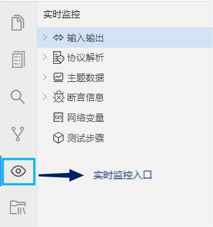

### 功能模块
此处，以“设备间进行UDP通信”为例讲解各功能模块的使用方法，在此之前，先进行必要的环境配置。配置步骤如下（完整程序请在示例中查看下载）：

1. 首先，新建设备并配置通道（操作步骤详见[【环境配置-仿真环境】](#/document?catalogId=31&id=36&type=doc)），例如：新建仿真环境文件env.env后，在其中新建设备dev和uut，并配置通道类型为UDP通道。

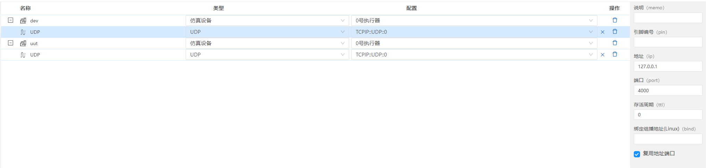
<center  style="font-size:14px">设备dev及属性配置</center>

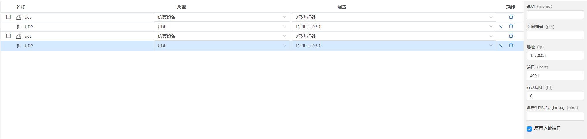
<center  style="font-size:14px">设备uut及属性配置</center>

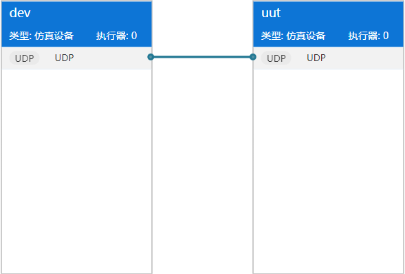
<center  style="font-size:14px">dev与uut的连接拓扑</center>

2. UDP协议的格式如下，本例中将该文件名称保存为prot.prot（操作步骤详见[【环境配置-通信协议】](#/document?catalogId=26&id=31&type=doc)）

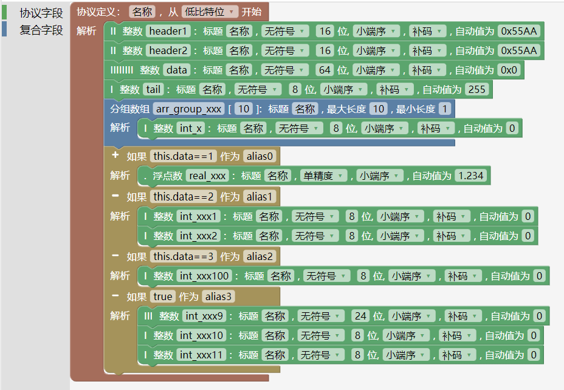

3. 在执行配置（.run文件）中,“仿真环境”配置为前文步骤中已经保存好的env.env文件；然后，“执行程序”中dev、uut设备分别配置为test.lua、uut.lua文件（完整代码在示例中）。

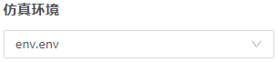
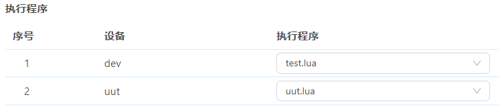

4. 配置好以上必要步骤后，按照分不同的功能模块进行讲解。

#### 输入输出
##### 界面
输入输出模块记录测试设备和被测设备间通信时的数据长度、内容、选项等。
1. 主界面如下图：
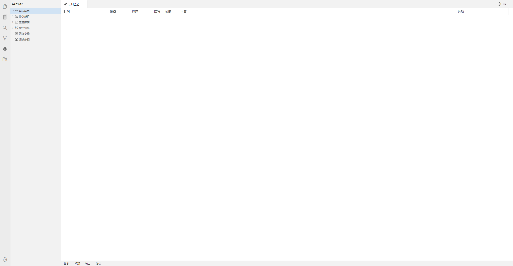

- 时间：数据收发的时间。
- 设备：当前监测的设备。
- 通道：当前监测的设备通道。
- 读写：设备读/写。
- 长度：收发的数据包长度。
- 内容：收发的数据包内容。
- 选项：通道的属性。该值为对端设备的通道属性。

2. 界面右上角功能如下图：

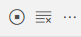

- 暂停刷新：暂停该界面的动态显示。
- 清空：清空当前页面上监测到的设备输入输出内容。
- 关闭全部：关闭所有打开的页面。

##### 配置步骤

1. 若想监测到设备的输入输出情况，需要在“执行配置（.run文件）>>记录通道读写”中选择要监测的设备和通道。例如：在执行配置文件中的“记录通道读写”勾选以下两个设备及通道。

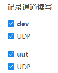

2. 本示例中，dev和uut通过以下代码进行收发数据（UDP及其他类型通道的更多使用方法请参考[【API-通道的使用】](#/document?catalogId=57&id=54&type=doc)）

(1) dev收发数据代码如下:
```lua
function entry()
  write_msg(channels.UDP, protocols.prot, {tail=1})
  on_buff_recv(channels.UDP, function (ch, res)
    etimer.delay(10)
    local res1 = unpack(protocols.prot, res.value)
    write_msg(channels.UDP, protocols.prot, {data=math.random(1,10), header1 =math.random(1, 65535), header2=math.random(1, 65535)})
    ebuff.shift_frame(res.value, 1)
  end)
end
```

(2) uut收发数据代码如下:

```lua
function entry()
  on_buff_recv(channels.UDP, function (ch, res)
    unpack(protocols.prot, res.value, true)
    local buff = pack(protocols.prot,{ header1 =math.random(1, 65535), header2=math.random(1, 65535)})
    write_buff(channels.UDP,buff.value)
    ebuff.shift_frame(res.value, 1)
  end)
end
```

3. 通过以上步骤，在实时监控中，可监测到dev和uut的UDP通道中收发数据情况分别如下图所示，其中“内容”及“长度”由协议的格式及设备收发数据的代码块决定。本例中，“选项”中的IP和端口号是在前文中配置通道属性时进行的设置，但在对端设备未知的情况下，“选项”中的值为实际对端设备的通道属性。

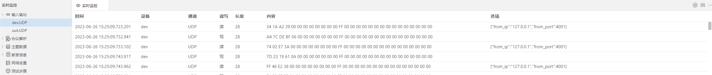
<center style="font-size:14px">dev的输入输出情况</center>

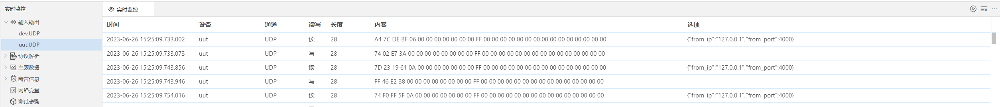
<center style="font-size:14px">uut的输入输出情况</center>

#### 协议解析
##### 界面
协议解析模块记录测试设备与被测设备之间收发数据时所用的协议，数据内容及报文内容等。

1. 主界面如下图：
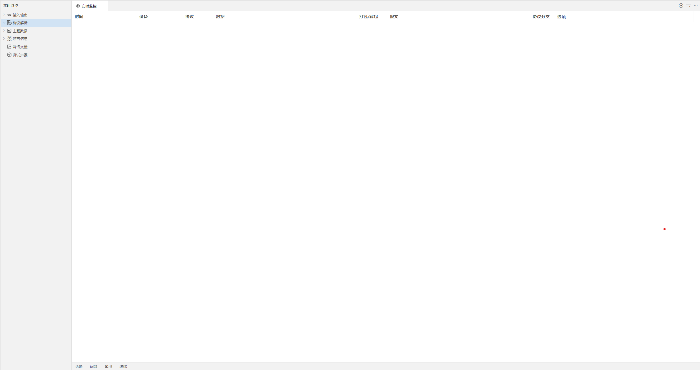

- 时间：数据收发的时间。
- 设备：当前监测的设备。
- 协议：当前监测的协议名称。
- 数据：收发的数据内容。
- 打包/解包：协议的打包或解包。
- 报文：收发的具体报文内容。
- 协议分支：打包时的协议解析路径。
- 选项：打包或解包时的属性。

2. 界面右上角功能如下图：

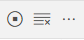
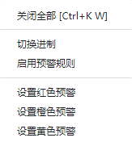

- 暂停刷新：暂停该界面的动态显示。
- 清空：清空当前页面上监测到的协议解析内容。
- 更多操作
  - 关闭全部：关闭所有打开的页面。
  - 切换进制：支持数据在二进制、十进制、十六进制间进行切换。
  - 启用预警规则：启用后可对监测到的报文内容进行预警。
    - 设置红色预警：启用预警并设置红色预警的条件后，可将报文中达到预警条件的记录用红色标注。
    - 设置橙色预警：启用预警并设置橙色预警的条件后，可将报文中达到预警条件的记录用橙色标注。
    - 设置黄色预警：启用预警并设置黄色预警的条件后，可将报文中达到预警条件的记录用黄色标注。

（1）“切换进制”功能详解：

i. 点击“切换进制”后，编辑器顶部会弹出“选择要切换的进制”窗口。例如：此处选择二进制（其他进制操作方法相同）。

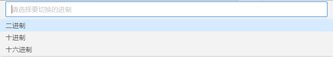

ii. 此时，“数据”中的值由二进制显示。

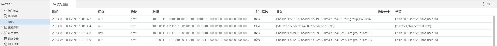

（2）“预警”功能详解：

i. 若想使不同级别“预警”功能生效，需保持该功能为启用状态。

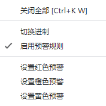

ii. 设置不同级别预警。此处，以“设置橙色预警”为例（红色/黄色预警操作方法相同），点击后顶部会弹出“设置橙色预警规则”窗口。

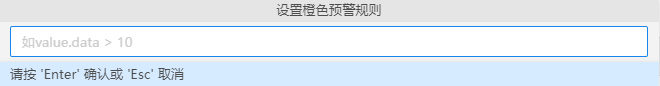

iii. 若想对报文中数据为大于1且小于4的数据进行预警。则输入`value.data>1 && value.data<4`

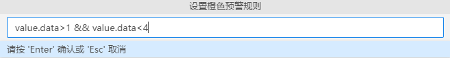

    输入内容遵循JavaScript语法规则：
    1. 条件：==（相等）、!=（不等）
    2. 比较：<（小于）、>（大于）
    3. 逻辑运算符：&&（与）、||（或）
    例如：在本节示例中，若想筛选报文的arr_group_xxx数组中第一个值不等于17的记录,代码为：`value.arr_group_xxx[1].int_x !=17`

iv. 设置条件后，符合条件的记录用橙色标记。

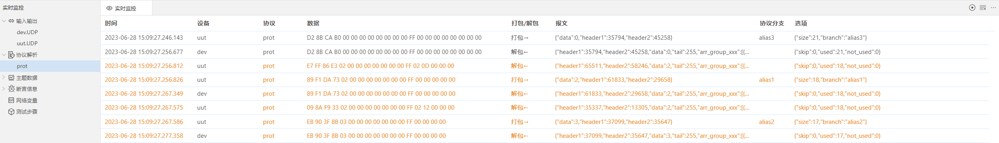


##### 配置步骤
1. 若想监测到协议解析情况，需要在执行配置中勾选要监测的协议。本例中，勾选prot.prot协议。

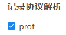

2. 通过上文中定义的协议及相关配置后，可监测到协议解析内容如下：

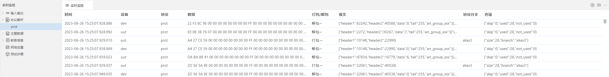

#### 主题数据

##### 界面

实时监控中的主题数据是通过etopic主题数据管理库实现。支持对通道中采集到的数据进行实时显示，也支持读取yaml文件中定义的测试数据，并通过etopic库中相应函数生成主题数据。该功能模块仅对数据进行展示，若想对全部数据进行统计和分析，可到“工具>>历史版本>>主题数据”中进行相关操作。

1. 主界面如下图：
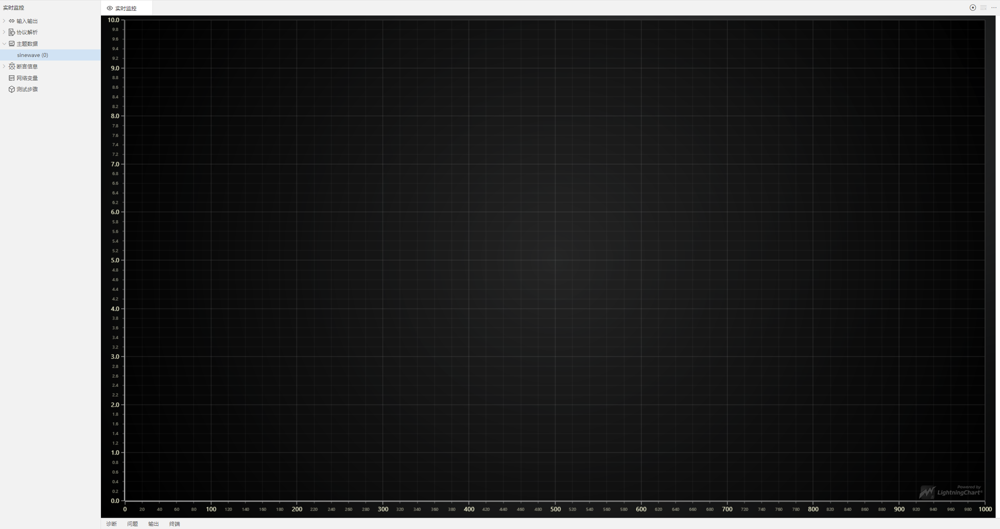

2. 界面右上角功能如下：

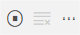
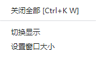

- 暂停刷新：暂停该界面的动态显示。
- 关闭全部：关闭所有打开的页面。
- 切换显示：支持以图表/表格形式进行展示。
- 设置窗口大小：此功能对图表形式显示的窗口大小进行设置。

（1）切换显示：

i. 点击“切换显示”后，编辑器顶部会弹出选择展示方式的窗口。

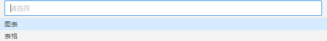

ii. 若选择“图表”，展示方式如下：

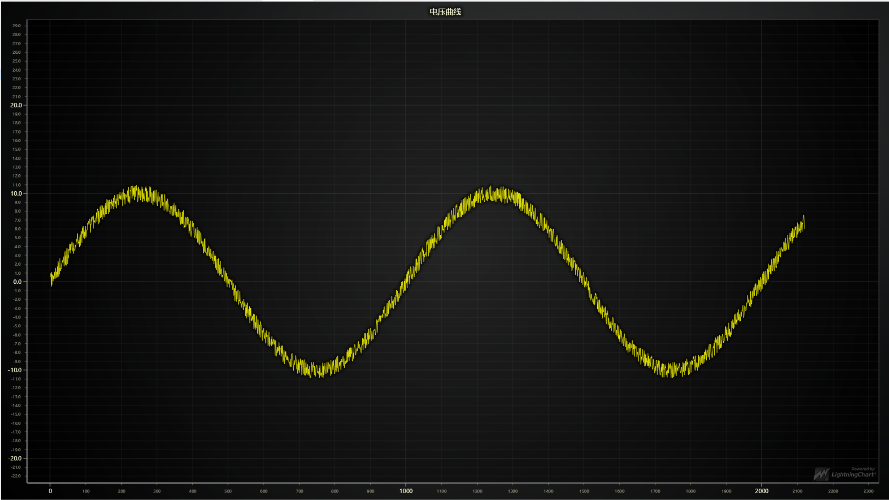

iii. 若选择“表格”，展示方式如下：


（2）设置窗口大小：

i. 点击“设置窗口大小”，编辑器顶部会弹出“设置窗口大小”的窗口。

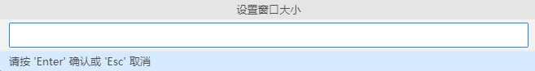

ii. 例如，此处输入窗口大小设置为1000，可看到横坐标的跨度为1000，效果如下：

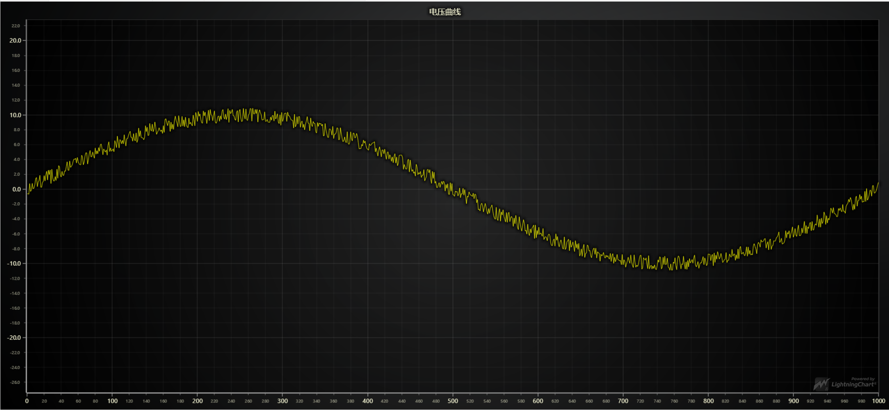


##### 配置步骤
1. 首先，通过etopic主题数据管理库中的相关方法（具体请查阅API手册）实现。其中，创建主题数据的API如下：
```lua
etopic.create(name，type，option)
功能：
  创建主题数据
输入参数：
  name：string 类型，主题名称(名称限制 20 个字符以内)
  type：string 类型，格式(xy、y、xyy...、yy...)
  option：table 类型，主题数据格式信息
  option.rate：number 类型，采样率
  option.style：string 类型，样式(line:曲线图)
  option.title：string 类型，标题
  option.labels：table 类型，每条曲线、散点图的名称({y1="s"，y2="s"...})
  option.axis：table 类型，坐标轴的名称({x="A"})
```

2. 我们以正弦波，坐标轴为‘xy’类型为例，讲解其使用方法。本例中，创建电压曲线，代码如下：
```lua
etopic.create('sinewave', 'xy', { rate=10000, style = 'line', title ='电压曲线图', axis={x="时间"}, labels = {y="电压"} }) 
```

3. 添加数据（完整代码可在示例中查看下载）后，可以观测到以下波形。

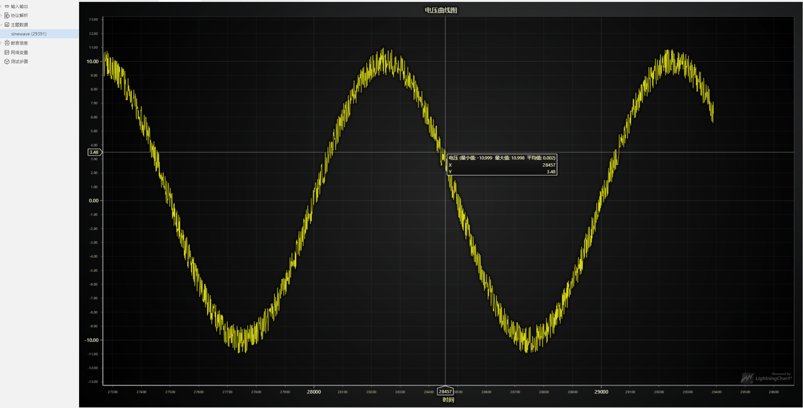

#### 断言信息
##### 界面
此功能模块可监测到断言是否通过等信息。
1. 主界面如下图：

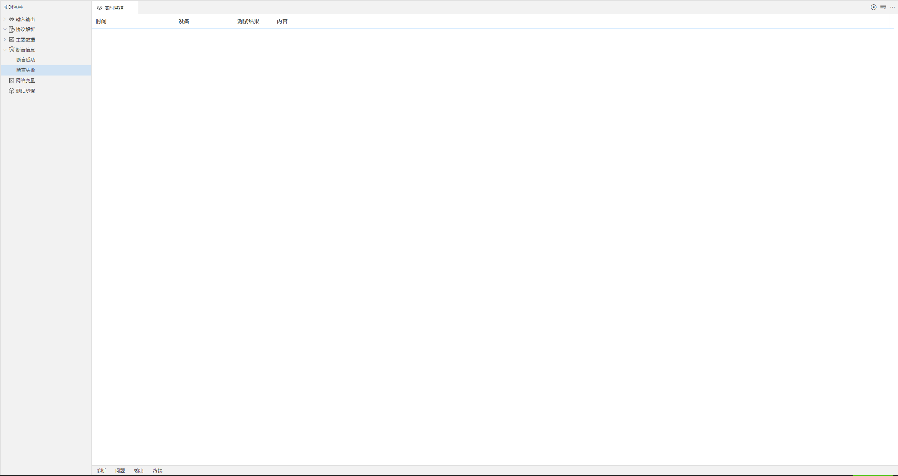

- 时间：数据收发的时间。
- 设备：当前监测的设备。
- 测试结果：断言通过或断言失败状态。
- 内容：断言成功/失败时的内容。

2. 界面右上角功能如下：

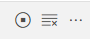

- 暂停刷新：暂停该界面的动态显示。
- 清空：清空当前页面上监测到的协议解析内容。
- 关闭全部：关闭所有打开的页面。

##### 配置步骤
1. 若使用断言信息，需要利用`check()`来实现，API如下：
```lua
passed = check(condition，ok_tip，fail_tip)
功能：
  执行断言，并输出断言结果提示信息
输入参数：
  condition：bool 类型，预期结果为 true 的表达式
  ok_tip：string 类型，断言成立时的提示信息
  fail_tip：string 类型，断言失败时的提示信息
返回值：
  passed：boolean 类型，断言是否通过
```
2. 本例中，判断dev接收的报文头header1值大于1000，则输出内容为“OK”，反之输出内容为“fail”。在dev对应的代码中加入以下语句，其中res1为解包的完整内容：
`check(res1.value.header1>1000, "dev第"..ind.."次接收的数据报头1大于1000", "dev第"..ind.."次接收数据报头1小于1000")`

3. 监测到断言成功和失败的界面分别如下：

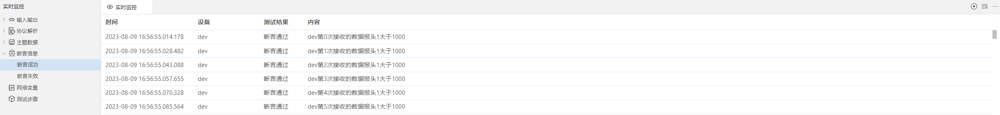
<center style="font-size:14px">断言成功界面</center>

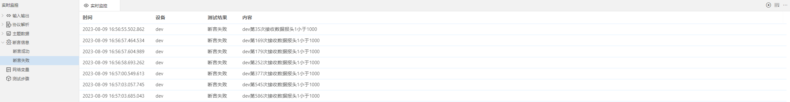
<center style="font-size:14px">断言失败界面</center>

#### 网络变量
##### 界面
在此功能模块中可监测到网络变量的变化情况，并可通过修改网络变量的值，在不借助UI界面的情况下，实现快速调试。

1. 主界面如下图：

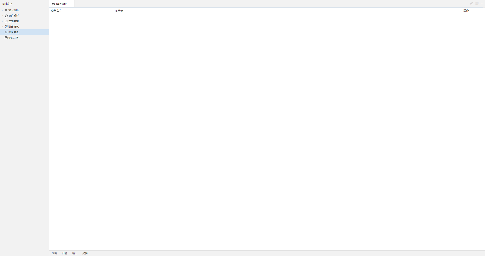

- 变量名称：网络变量的名称。
- 变量值：网络变量的值。
- 操作：提交修改/取消修改。通过修改网络变量的值可实现快速调试。

##### 配置步骤
1. 网络变量通过`set_value()`实现，API如下：
```lua
set_value(key，value)
功能：
  设置网络变量对象 key 值所对应的 value 值
输入参数：
  key：string 类型，属性名称
  value：any 类型，属性值
```

2. 首先，新建yaml文件并定义网络变量。在本例中，定义变量a、b、c如下，并将其保存为demo.yml文件。
```yaml
a:
  a1: ""
b: []
c:
  qq: 0
  rr: ""
```

3. 然后，根据实际情况在测试设备及被测设备对应的程序中设置网络变量的值。本例中，在dev对应的dev.lua文件中添加如下代码以更新网络变量：
```lua
set_value("$.a.a1", "a.a1为："..tostring(math.random()))
set_value("$.b", {"b.b1为："..math.random(1, 65590), "b.b2为："..math.random()})
set_value("$.c", {qq=math.random(1, 30000), rr="rr:"..math.random(1, 100)})
```

4. 最后，在“执行配置中（.run文件）>>网络变量”中选择定义好的demo.yml文件。

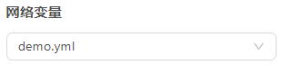

5. 经过上述步骤后，可监测到网络变量的界面如下图：

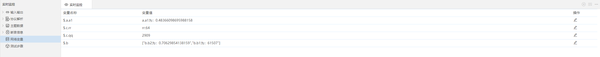

#### 测试步骤
##### 界面
该功能模块中可记录输入及操作步骤，以及期望值和实际输出值是否一致等信息。
1. 主界面如下图：
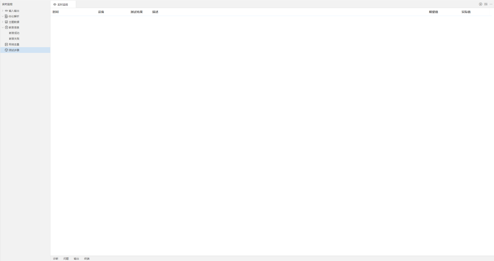

- 时间：数据收发的时间。
- 设备：当前监测的设备。
- 测试结果：通过/失败。
- 描述：步骤的描述信息。
- 期望值：期望的输出值。
- 实际值：实际输出值。

**注：** 在【执行与报告】功能模块中运行了项目后，可在“测试记录”文件中下载该测试步骤。相应地，若将运行结果保存为历史版本后，也可在【历史版本】中进行下载。

2. 界面右上角功能如下：

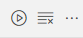

- 暂停刷新：暂停该界面的动态显示。
- 清空：清空当前页面上监测到的测试步骤内容。
- 关闭全部：关闭所有打开的页面。

##### 配置步骤
1. 测试步骤由`step()`实现，API如下：
```lua
passed = step(tip，expect，result，passed)
功能：
  记录执行步骤的信息，始终不退出
输入参数：
  tip：any  类型，执行步骤描述
  expect：any 类型，期望结果描述  
  result：any 类型，实际结果描述
  passed：boolean 类型，是否通过测试
返回值：
  passed：boolean 类型，是否通过测试
```

2. 根据实际想要测试的步骤在对应程序中输入相关代码。本例中，若想记录被测设备uut的测试步骤，判断其收到的报文数据值为4时测试通过，则在uut.lua中输入以下代码，其中ind为程序执行的次数，res2为接收到的报文内容：
```lua
step("step"..ind,4,res2.value.data,res2.value.data==4)
```

3. 经过上述步骤后，可监测到如下测试步骤：

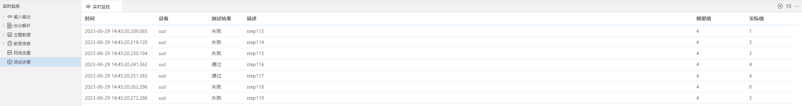

#### 实时交互（单独功能模块）
##### 界面
该功能模块中支持用命令或操作组件实现与程序的交互。

1. 功能如下：
- 命令交互：在程序运行过程中，通过命令实现交互。
- 操作交互：在程序运行过程中，通过交互结果执行不同的程序分支。

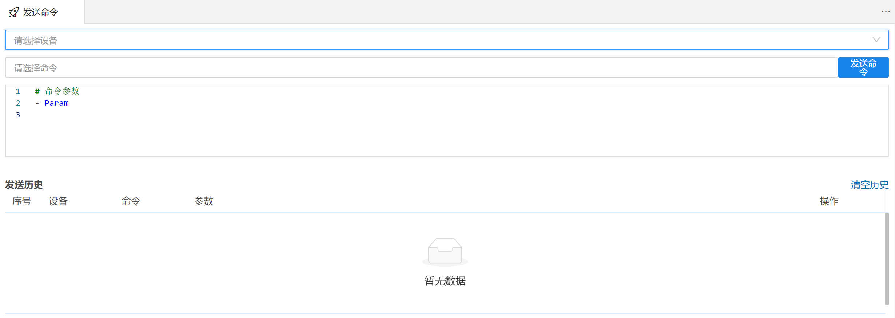
<center style="font-size:14px">命令交互</center>

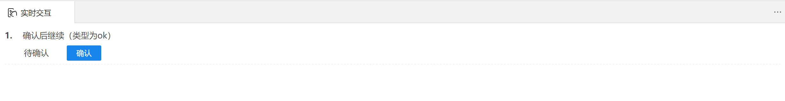
<center style="font-size:14px">操作交互</center>

##### 配置步骤
1. 命令交互

i. 在设备对应的脚本中定义函数。本例中，在test.lua中定义了函数`sendCmd()`，代码如下：
```lua
function sendCmd(var1)
  print('sendCmd1:', var1)
end
```
ii. 执行程序后，在lua界面右上角点击

ii. IDE右侧会弹出命令窗口。然后，在cmd中输入该函数名称，选择设备，并输入参数。本例中，如下图：

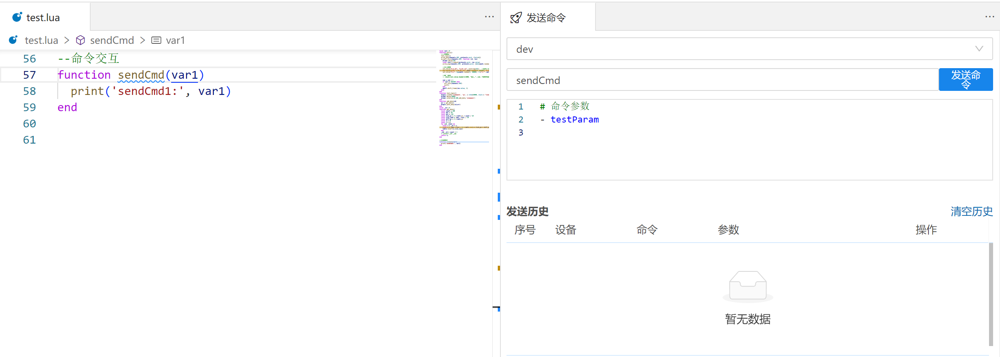

iii. 发送命令后，可以看到发送历史情况。

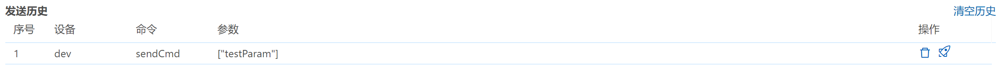

2. 操作交互

i. 操作交互动作由`ask()`实现，API如下：
```lua
value = ask(type，option)
功能：
  暂停执行，直到用户界面操作返回结果，待用户确认后继续执行
输入参数：
  type：string 类型，界面交互方式(ok，yesno，text，number，select，multiswitch)
option：
  dict 类型，界面交互选项
返回值：
  value：any 类型，用户界面操作结果
```

ii. 为实现操作交互，需要根据用户实际需求编写脚本，然后在“执行配置（.run）>>执行程序”中选择此脚本文件，执行程序后，在IDE右侧弹出交互窗口。本例中，新建ask.lua文件，接下来分步骤展示代码效果：

a. `ask('ok',  {title='确认后继续', msg='类型为ok' , timeout=2*1000}) --2s后自动确认`

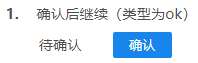

b. `ask('yesno',  {title='请回答yes或no', msg='类型为yesno', default=true})`

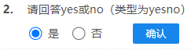

c. `ask('text', {title='请输入字符串', msg='类型为text', default='abcd'})`


d. `ask('number', {title='请输入数字', msg='类型为number', default=50, min=0, max=100})`

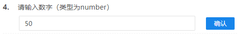

e. `ask('select', {title='请选择', msg='类型为select', default='第一项', items={'第一项','第二项', '第三项'} })`


f. 
```lua
local answer5 = ask("multiswitch",
                {title = "按照以下指示进行开关操作",
                  msg = "类型为multiswitch", 
                  items = {
                      {name = "开关1",on = true,disabled = true,value = "button1"}, 
                      {name = "开关2",on = false,disabled = false,value = "button2"}
                  }
                }
              )
```

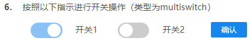


