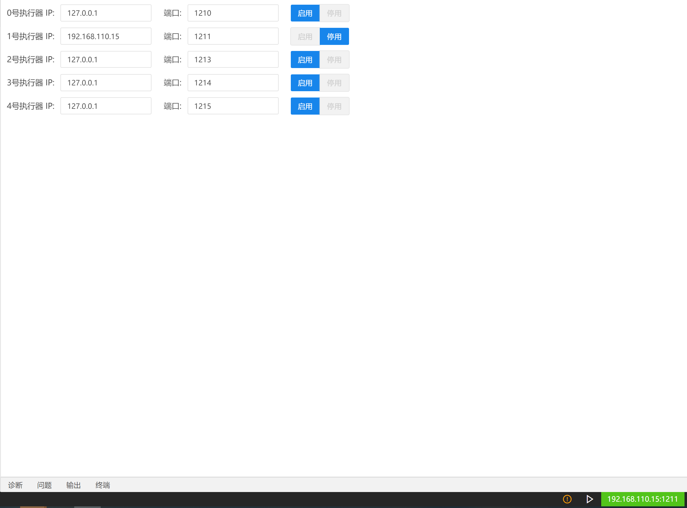

## 实时执行器

### 实时的含义

- 足够短的响应时间：在足够短的时间内作出响应
- 确定的时间调度：在设定的准确时间内做出响应
- 事件驱动：在特定条件触发时进行处理
- 流数据处理：数据流入的同时进行处理

### 部署环境

实时执行器的部署环境具有实时内核的Linux操作系统。

在Linux 操作系统中，调度算法（基于最大吞吐量准则）、设备驱动、不可中断的系统调用、中断屏蔽以及虚拟内存的使用等因素，都会导致系统在时间上的不可预测性，决定了Linux操作系统不能处理硬实时任务。

Linux-RT为避免这些问题，在Linux内核与硬件之间增加了一个虚拟层（通常称作虚拟机），构筑了一个小的、时间上可预测的、与Linux内核分开的实时内核，使得在其中运行的实时进程满足硬实时性。并且Linux-RT和Linux构成一个完备的整体，能够完成既包括实时部分又包括非实时部分的复杂任务。

### 实时API

- 除以“rt_”为前缀的API外，两个版本执行器的其它API均相同
- 调用“is_rt()”会返回当前执行器是否为实时执行器的布尔值
- 详细的实时API参见EAPI

### 连接实时执行器

依次选择设置、执行器连接设置，输入实时执行器的IP地址与端口号，以ip：192.168.110.15,端口：1211为例点击启用，右下角蓝色显示IP地址与端口号即连接成功。
