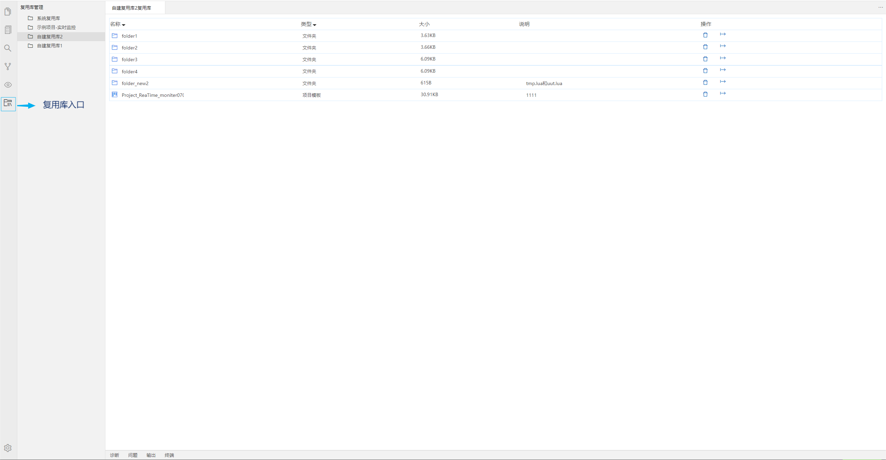

## 复用库管理

复用库是对已有资源的重复利用。在构建项目的过程中，通过导入已有的完整项目或项目中的某一或多个文件（执行配置文件、仿真环境文件等），以减少重新新建、配置、开发等操作，达到快速构建项目，大幅提升工作效率的目的。

### 复用库管理界面
从左侧活动栏中点击进入复用库管理界面，界面包含侧边栏目录和右侧面板。目录中默认自带一个复用库，即系统复用库，该复用库不支持编辑。后续用户可自行新建、删除、重命名自定义复用库。右侧面板中包含复用库的名称、类型、大小、说明和操作。下图分别为系统复用库界面和自定义复用库界面。

 

系统复用库

自定义复用库

- 名称：添加到复用库中的文件（夹）或项目的名称。点击名称旁边的三角，可对名称按照升序或添加到复用库的时间进行排序。系统复用库中不允许编辑名称，在自定义复用库中，选中后，单击即可修改名称。
- 类型：操作对象的所属类型。比如添加的是通信协议文件，那么类型为“通信协议”；添加的是项目，类型则为“项目模板”。点击类型旁边的三角，可对文件（夹）或项目所属的类型名称按照升序或添加到复用库的时间排序。
- 大小：文件（夹）或项目的实际大小。
- 说明：系统复用库中不允许编辑说明内容，在自定义复用库中，可对文件（夹）或项目添加描述性信息。选中后，单击即可修改说明内容。
- 操作：系统复用库中只支持导出，自定义复用库中，可对文件（夹）或项目删除或导出。

### 复用库操作对象:
- 文件（详见[【文件管理-复用库操作（文件）】](#/document?catalogId=12&id=22&type=doc#BuildFromReuse2)）
- 文件夹（详见[【文件管理-复用库操作（文件夹）】](#/document?catalogId=12&id=22&type=doc#BuildFromReuse3)）
- 项目（详见[【项目管理-复用库操作（项目）】](#/document?catalogId=9&id=19&type=doc#BuildFromReuse1)）

### 复用库类型
- 系统复用库：
  系统复用库是自带的复用库，不支持系统复用库的新建、重命名、删除操作，以及向其中添加、编辑和删除文件（夹）和项目模板，但可以导出以及在新项目中引用其中的文件（夹）和项目模板。
- 自定义复用库：
  自定义复用库由用户自己创建，支持文件（夹）和项目的添加、编辑、删除和导出，以及在新建文件（夹）、新建项目时引用其中的资源。

  【操作】     
   - 新建：在侧边栏目录中，空白区域右键，点击新建，在编辑器顶部会弹出新建复用库窗口，输入新建的复用库名称，点击Enter（确认）/ESC（取消），确认后即可在目录树中看到新建的复用库。
   - 重命名：选中自定义复用库，右键即可修改复用库名称。
   - 删除：选中自定义复用库，右键即可删除。

