## 文件管理
文件管理提供了对执行配置文件、通信协议文件等不同类型文件进行新建、重命名、复用等功能。
### 文件类型
共分为以下18种类型：
- 测试流程模型
- 因果图模型
- 组合对模型
- 模糊测试
- 执行配置
- 仿真环境
- 通信协议
- Yaml文件
- 执行程序（Lua）
- 执行程序（状态图）
- 执行程序（流程图）
- 执行程序（表格）
- 菜单配置（player）
- 界面（web）
- 界面（react）
- FlexRay配置
- 1553RT配置
- 1553BC配置

### 文件基本操作
#### 新建文件
创建文件有两种方式：
- 首次创建
- 从复用库创建（详见下文：[复用库操作(文件)-从复用库创建](#/document?catalogId=12&id=22&type=doc#BuildFromReuse2)）

首次创建步骤如下：
在侧边栏打开的项目中任意位置，鼠标右键单击>>新建文件>>选择文件类型，完成。

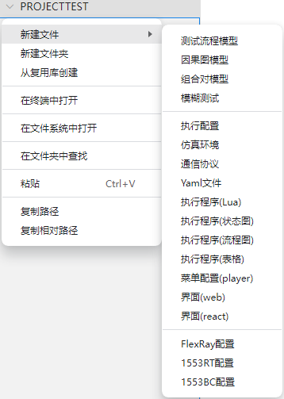

#### 其他常用操作
1. 选中文件后右键，可进行以下常用操作（快捷键见附表）：
- 删除：删除文件
- 重命名：修改文件名称
- 复制：支持复制文件
- 粘贴：支持粘贴文件
- 剪切：支持剪切文件
- 复制路径：可快速复制其在文件系统中的绝对路径
- 复制相对路径：可快速复制其在文件系统中的相对路径
- 打开文件：单击该文件可在当前标签页中显示，双击该文件可在新的标签页中显示，还可通过右键的方式打开文件
- 打开方式：可在当前的编辑器或配置的其他编辑器中打开。
**注：目前只支持在当前编辑器中打开**
- 在终端打开：可在编辑器下方快速打开终端
- 在文件系统中打开：快速定位到其在文件系统中的位置
2. 在打开的标签页，右键菜单栏中，可进行以下常用操作（快捷键见附表）：
- 关闭单个文件：鼠标移动到打开的标签页上时，点击“关闭”按钮
- 关闭全部文件：关闭全部已打开的文件
- 关闭已保存：只关闭已保存的文件
- 关闭其他：关闭除选中文件的所有文件
- 关闭到右侧：关闭选中文件右侧的所有文件
- 向左拆分：向左拆分窗口
- 向右拆分：向右拆分窗口
- 向上拆分：向上拆分窗口
- 向下拆分：向下拆分窗口
3. 在顶部菜单栏的"文件"中，可进行保存（快捷键见附表）：
- 保存文件：保存当前文件
- 保存全部：保存全部文件

**附表：常用快捷键**

<table width="100%">
   <tr>
      <th>前置操作</td>
      <th>操作</td>
      <th>快捷键</td>
   </tr>
   <tr>
      <td rowspan="5">选中文件后进行快捷操作： （1）选中单个文件：单击选中 （2）选中连续的多个文件：长按Shift，然后单击选中文件 （3）选中不连续的多个文件：长按Ctrl，然后单击选中文件</td>
      <td>删除</td>
      <td>Del</td>
   </tr>
   <tr>
      <td>重命名</td>
      <td>Enter</td>
   </tr>
   <tr>
      <td>复制</td>
      <td>Ctrl+C</td>
   </tr>
   <tr>
      <td>粘贴</td>
      <td>Ctrl+V</td>
   </tr>
      <tr>
      <td>剪切</td>
      <td>Ctrl+X</td>
   </tr>
   <tr>
      <td align="center">—</td>
      <td>关闭单个文件</td>
      <td>Ctrl+W</td>
   </tr>
   <tr>
      <td align="center">—</td>
      <td>关闭全部文件</td>
      <td>Ctrl+W K（注：此处表明需要先按Ctrl和W键才能生效）</td>
   </tr>
   <tr>
      <td align="center">—</td>
      <td>保存单个文件</td>
      <td>Ctrl+S</td>
   </tr>
   <tr>
      <td align="center">—</td>
      <td>保存全部文件</td>
      <td>Ctrl+Alt+S</td>
   </tr>
   </tr>
   <tr>
      <td align="center">—</td>
      <td>向右拆分</td>
      <td>Ctrl+\</td>
   </tr>
</table>

### 复用库操作(文件)

#### 从复用库创建

1. 在侧边栏打开的项目中任意位置，鼠标右键单击，出现下拉菜单项。

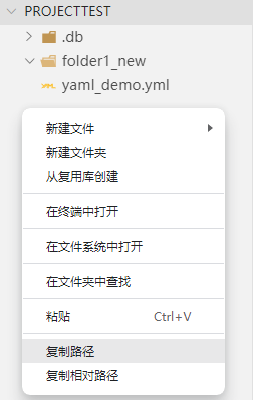

2. 选择“从复用库创建”，顶部会弹出“从复用库选择创建（1/2）”，选择要导入的文件，例如此处选择自建复用库（测试）中的luaTest.lua文件。

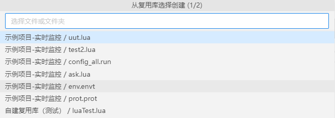

3. 输入其在当前项目中的新名称，如：luaTest_new。

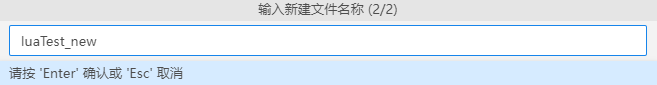

4. 输入Enter/ESC进行确认/取消，确认后在当前项目中即可查看到luaTest_new.lua创建成功。

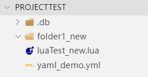

#### 添加到复用库
1. 在侧边栏打开的项目中，鼠标右键选中要操作的文件，出现下拉菜单项。

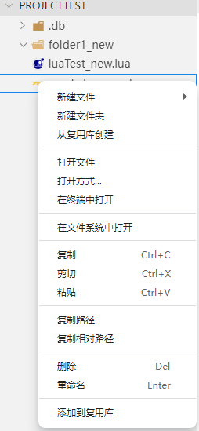

2. 选择“添加到复用库”,顶部会弹出“选择复用库（1/3）”窗口，在此窗口中选择某一要添加到的自定义复用库，例如此处选择“自建复用库（测试）”。

   **注** ：“选择复用库（1/3）”中括号内含义：当前操作步骤位于总操作步骤中的位置。

3. 输入此文件在复用库中的名称，例如：将设备命名为yaml_demo_new。

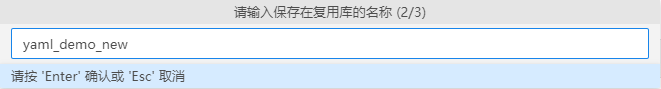

4. 输入文件的说明信息，例如：添加说明信息“新yaml文件”。

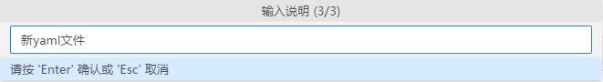

5. 输入Enter/ESC进行确认/取消，确认后到复用库管理模块中对应的复用库中查看，文件及说明信息添加成功。若需要修改名称或说明，在此界面中单击对应位置即可修改。

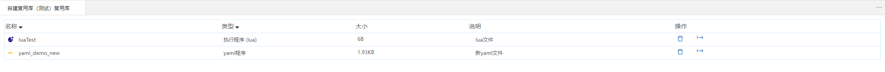

### 复用库操作(文件夹)

#### 从复用库创建  

1. 在侧边栏打开的项目中任意位置，鼠标右键单击，出现下拉菜单项。

2. 选择“从复用库创建”，顶部会弹出“从复用库选择创建（1/2）”，选择要导入的文件夹，例如：此处选择自建复用库2中的folder1文件。

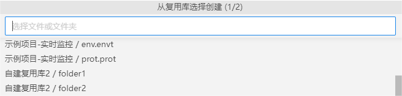

3. 输入该文件夹在当前项目中的新名称，如：folder1_new。

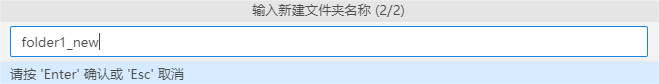

4. 输入Enter/ESC进行确认/取消，确认后在当前项目中即可查看到folder1_new创建成功。

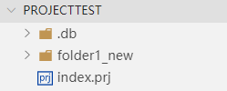

#### 添加到复用库

1. 在侧边栏打开的项目中，鼠标右键选中要操作的文件夹，出现下拉菜单项。例如：选中 tmp.lua和uut.lua文件，将其作为文件夹保存到复用库。

**注**：长按Shift，可选中连续文件或文件夹；长按Ctrl，可选中不连续的文件或文件夹。

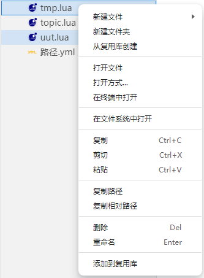

2. 选择“添加到复用库”，顶部会弹出“选择复用库（1/3）”窗口，在此窗口中选择某一要添加到的自定义复用库。例如：选择“自建复用库2”。

3. 输入此文件夹在复用库中的名称，例如：将文件夹命名为folder_new2。

4. 输入文件夹的说明信息，例如：添加说明信息“ tmp.lua和uut.lua”。

 

5. 输入Enter/ESC进行确认/取消，确认后到复用库管理模块中对应的复用库中查看，文件夹及说明信息添加成功。若需要修改名称或说明，在此界面中单击对应位置即可修改。

 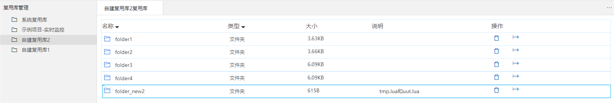