## 源代码管理

源代码管理（Source Code Management，SCM）是一种管理软件开发过程中源代码的方法。它可以追踪代码的变化历史，协调多人协作开发，恢复历史版本等。本系统提供了源代码管理工具Git，可以帮助开发者将代码存储在中央仓库或分布式仓库中，进行版本控制、分支管理、合并冲突等操作。使用源代码管理工具可以提高开发效率和代码质量，减少错误和重复工作，方便团队协作和追踪项目进度。

### 源代码管理使用的前置条件

- 安装Git

要想使用Git的源代码管理，本机需要从官方网站 (https://git-scm.com/download) 下载合适的Git版本。下载后，安装时只需根据提示一路单击“Next”按钮即可。安装完成后，启动CMD命令，输入 git --version，如果显示git版本信息，证明安装成功。

- 用户设置

启动CMD，输入下面两行命令，设置用户的E-mail信箱及用户名。

    git config --global user.name "zhang"
    git config --global user.email "zhang@5xruby.tw"

输入完成后，使用下面命令再检查一下当前的设置是否成功。

    git config --list

### 克隆仓库

- 作用：将远程仓库的代码复制到本地。

- 流程

1.启动本系统，显示“克隆仓库”按钮。

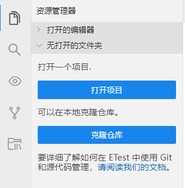

2.找到要克隆项目的代码仓库，点击“克隆/下载”，点击“复制”，复制地址成功。

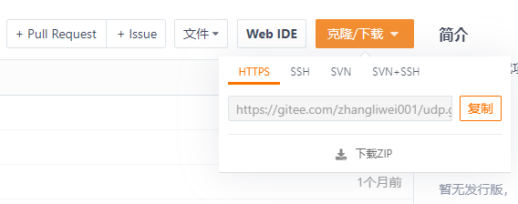

3.点击“克隆仓库”，显示存储库URL输入框。将复制的地址粘贴到存储库URL输入框内，识别地址有效后，显示在下拉列表里，点击该列表中的地址。

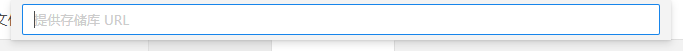

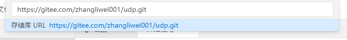

4.选择存储库位置，开始克隆仓库内容。克隆完成后，弹窗上有两个选项，选择“打开”，打开克隆成功的项目；选择“在新窗口中打开”，在新窗口打开克隆成功的项目。

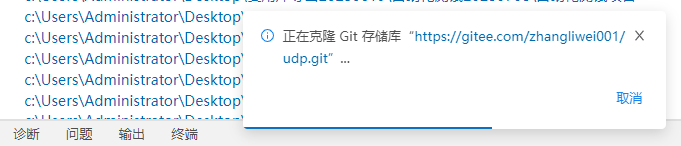

### 初始化仓库

- 作用：当项目没有使用Git进行管理时，需要先进行初始化仓库操作，实现Git提供支持的源代码管理功能。
- 流程

1.启动本系统，打开项目，进入源代码管理页面。

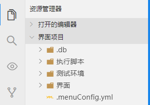
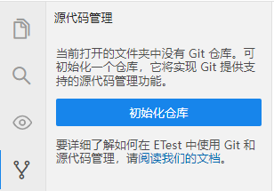

2.点击“初始化仓库”后，项目Git仓库初始化完成。

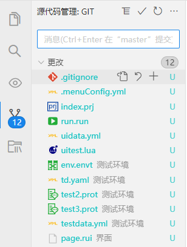
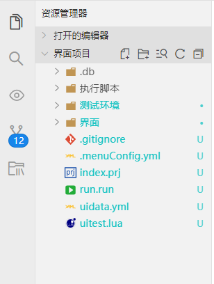

2.1 仓库初始化完成后，项目里增加了.gitignore文件。该文件是一个用于指定Git版本控制系统忽略哪些文件和目录的文件。如果您想让Git忽略特定的文件或目录，可以将它们添加到.gitignore文件中，这样它们就不会被Git跟踪或提交到仓库中。

以下是一个示例.gitignore文件：

        # 忽略所有的 .log 文件
        *.log

        # 忽略 build 目录下的所有文件
        /build/*

        # 忽略 .DS_Store 文件
        .DS_Store

在这个示例中，.gitignore文件指示Git忽略所有扩展名为.log的文件，build目录下的所有文件以及名为.DS_Store的文件。您可以根据需要添加或删除其他规则。

2.2 项目里有如果更改的文件，在资源管理器入口上有更改文件数量标识。

2.3 文件后面显示文件状态。在Git中，文件可以有以下几种状态：

        未跟踪（Untracked）：文件尚未被Git跟踪，也没有添加到Git仓库中。
        已修改（Modified）：文件已被修改，但尚未添加到Git暂存区中。
        已暂存（Staged）：文件已被添加到Git暂存区中，但尚未提交到本地仓库中。
        已提交（Committed）：文件已被提交到本地仓库中。

2.4 系统底部左下角显示分支名称和状态。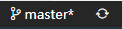

### Git操作

- 文件操作

1.鼠标移动到文件上，点击“打开文件”，在编辑区域打开该文件。

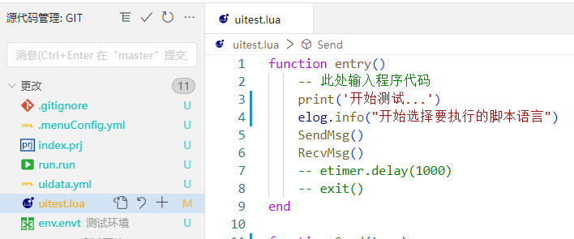

2.鼠标移动到文件上，点击“放弃更改”，弹出确认框，确认后删除文件。

3.鼠标移动到文件上，点击“暂存更改”，该文件移动到暂存的更改区域。

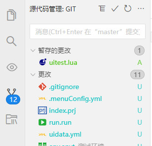

4.鼠标移动到文件上，点击“取消暂存更改”，该文件移动到更改区域。

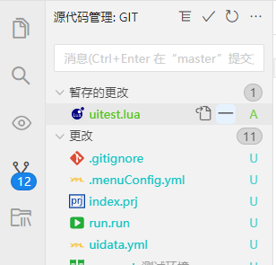

5.鼠标移动到文件上，点击文件后的文件状态标识，例如点击M，在编辑区域显示该文件最近两次的对比内容。

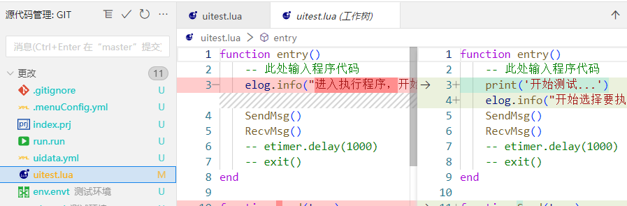

- 以列表形式查看和以树形式查看切换

源代码管理页面，点击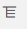，切换文件的查看方式。

- 提交

在Git中，提交（Commit）是指将更改保存到本地仓库中的操作。每个提交都包含一个提交注释，用于描述更改的内容。通过提交，您可以在Git仓库中跟踪项目的历史记录，并轻松地回滚到以前的版本。

1.文件已暂存更改，点击“提交”，弹窗输入提交的信息，确认后提交成功。

  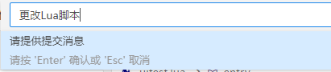

2.文件没有操作暂存更改，点击“提交”，确认提示界面选择“是”，提交成功。

  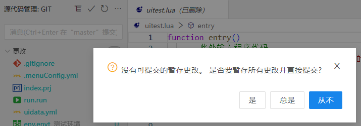

- 刷新

点击“刷新”，刷新项目里文件的状态。

### 更多操作

  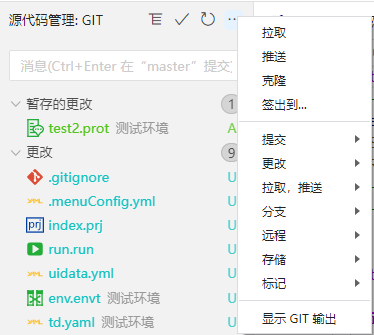

- 拉取

拉取（Pull）是指从远程仓库中获取最新版本的代码并将其合并到本地仓库中。通常，您需要在开始工作之前拉取最新的代码以确保您的本地代码与远程代码保持同步。

- 推送

推送（Push）是指将本地仓库中的更改上传到远程仓库中。如果您在本地仓库中进行了更改，并希望与其他人共享这些更改，则需要将它们推送到远程仓库中。

- 克隆

克隆（Clone）是指从远程仓库中复制代码库并创建一个本地副本的操作。如果您想在本地计算机上开始使用一个现有的Git项目，则可以使用克隆功能。

- 签出到...

签出（Checkout）是指将代码库的工作树切换到指定的分支或提交。如果您想查看项目的历史记录或在不同的分支之间切换，则可以使用签出功能。

- 提交

提交操作可以进一步细化，包含以下操作功能：

    - 提交：将更改保存到本地仓库中。
    - 提交已暂存文件：将暂存的更改提交到本地仓库中。
    - 全部提交：更改的文件和暂存更改的文件全部提交。
    - 撤销上次提交：撤销上一次的提交操作。
    - 中止变基：如果您正在执行变基（Rebase）操作，但是发现出现了问题，您可以中止变基操作并回到之前的状态。
    - 提交已暂存文件(修改)：是指将已经暂存的更改提交到代码库中，并为提交添加注释。
    - 全部提交(修改)：更改的文件和暂存更改的文件全部提交到代码库中，并为提交添加注释。
    - 提交已暂存文件(已署名)：是指将已经暂存的更改提交到代码库中，提交的信息中带有署名信息。
    - 全部提交(已署名)：更改的文件和暂存更改的文件全部提交到代码库中，提交的信息中带有署名信息。

- 更改

更改有以下3种更改方式：

    - 暂存所有更改：把所有更改添加到Git暂存区中，包括新创建的文件和已修改的文件。
    - 取消暂存所有更改：这将会将所有更改从暂存区中移除，并还原为上一次提交的状态。
    - 放弃所有更改：这将会将您的代码库还原到最近一次提交的状态，同时丢弃所有未提交的更改。该操作将永久性地删除所有未提交的更改。因此，在使用该命令之前，请确保您已经备份了所有重要的更改，并确认您不再需要这些更改。

- 拉取、推送

拉取、推送包含以下操作功能：

    - 同步：执行拉取和推送两个操作。将远程仓库的代码更新合并到本地分支，更新本地仓库的代码。然后将本地仓库中的更改上传到选中的远程仓库中。
    - 拉取：将远程仓库的代码更新合并到本地分支，同时也会更新本地仓库的代码。
    - 拉取(变基)：用于将远程仓库中的更改合并到本地仓库中，同时拉取所有标记（tags）并进行变基操作（rebase）。
    - 拉取自...：选择一个远程位置进行拉取。
    - 推送：将本地仓库中的更改上传到默认的远程仓库中。
    - 推送到...：将本地仓库中的更改上传到选中的远程仓库中。
    - 抓取：将远程仓库的代码更新下载到本地仓库，但不会自动合并到当前分支，需要手动进行合并。
    - 获取(删除)：用于从远程仓库中获取最新的更改，并删除本地仓库中已经不存在于远程仓库中的分支引用。
    - 从所有远程存储库中拉取：将远程仓库的代码更新下载到本地仓库。

- 分支

分支包含以下操作功能：

    - 合并分支...：将另一个分支合并到当前的分支上。
    - 变基分支...：重新定义分支的参考基准，将当前的分支的参考基准重新设置。在Git中，变基（Rebase）是指将一个分支的提交历史记录应用到另一个分支上的操作。变基通常用于将一个分支的更改合并到另一个分支中，以便产生一个更干净的提交历史记录。
    - 创建分支...：创建新分支。
    - 从现有来源创建新的分支...：选择一个已存在的分支，在此基础上创建新的分支。
    - 重命名分支...：修改分支名称。
    - 删除分支...：删除已选择的分支。
    - 发布分支...：将分支发布到远程存储库。

- 远程

远程包含以下操作功能：

    - 添加远程存储库...：添加远程仓库的地址。
    - 删除远程存储库...：删除远程仓库。

- 存储

存储包含以下操作功能：

    - 储藏：将当前的未提交更改储藏起来。这将会将您的更改保存到一个临时区域，让您可以切换到干净的工作目录。
    - 储藏(包含未跟踪)：将当前的未提交更改和未跟踪状态的文件都储藏起来。
    - 应用最新储藏：将之前储藏的更改重新应用到当前工作目录中，但是不会从堆栈中删除该储藏。
    - 应用储藏...：可以选择之前的任意一个存储记录应用到当前工作目录中，但是不会从堆栈中删除该储藏。
    - 弹出最新储藏：应用最近的那个储藏。一旦应用成功，该储藏将会从堆栈中删除。
    - 弹出储藏...：可以选择之前的任意一个存储记录，一旦应用成功，该储藏将会从堆栈中删除。
    - 删除储藏...：从堆栈中删除储藏。

- 标记

标记包含以下操作功能：

    - 创建标记：创建标记输入标记名称和标记相关的消息内容后提交后，该条标记会包含标记名称、标记创建者、标记创建时间以及标记消息等信息。可以帮助跟踪代码库中的重要事件，例如发布版本或重要的里程碑。
    - 删除标签：选择删除已提交的标记记录。

- 显示GIT输出：打开GIT输出界面。

### 分支操作

点击系统底部左下角的分支名称，弹窗上可以进行分支操作和分支切换。

- 正在创建新分支...：可以创建新分支。
- 从...创建分支：在一个已有的分支基础上创建新的分支。
- 签出已分离：
- 显示仓库里所有的分支：选择任意分支进行切换，设置为当前分支。