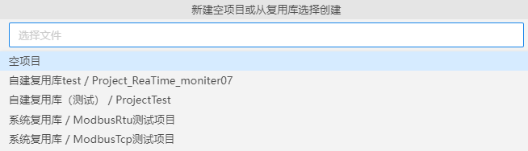
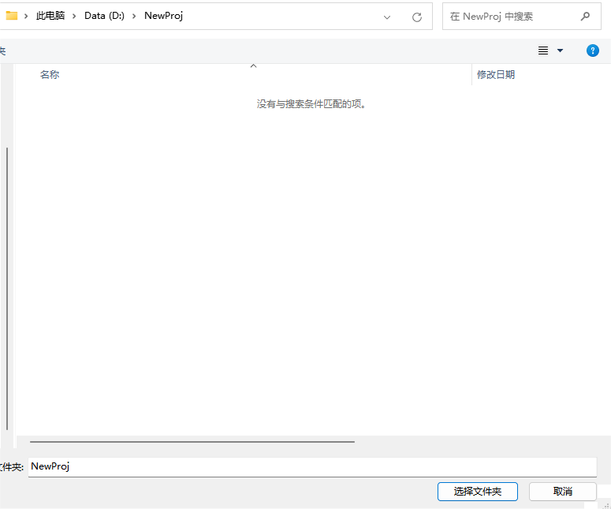
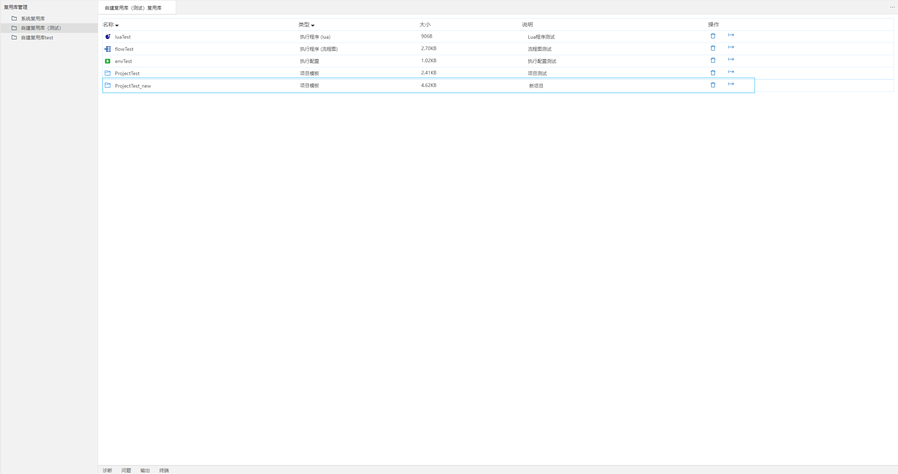

## 项目管理

项目是管理所有文件的一种方式，这些文件结合在一起可生成单个应用程序。应用程序文件包括源代码、资源和配置。项目将其所有文件之间的关系形式化并予以维护。

### 项目目录结构
**注:** 以“.”开头的文件夹为系统自动生成
- .db文件夹：该目录存放数据库相关文件
- .etest-oss文件夹：该文件夹是用户自定义配置时自动生成的文件夹
- 其他文件：用户可根据项目需要自行创建文件
- 其他文件夹：为了使目录更加清晰，用户可自由新建文件夹管理相应文件及其他文件夹

### 项目基本操作
#### 新建项目
创建项目有两种方式：
- 首次创建
- 从复用库创建（详见下文：[复用库操作(项目)-从复用库创建](#/document?catalogId=9&id=19&type=doc#BuildFromReuse1)）

首次创建步骤如下：

1. 点击“文件>>新建项目”，顶部会弹出“新建空项目或从复用库选择创建”窗口。

2. 选择“空项目”后，弹出“新建项目”窗口，选择一个空文件夹。

3. 完成，新建的空项目会在新的窗口中打开。

【**说明**】新建的项目中默认带有index.prj文件，该文件用来定义打包输出（操作步骤详见[【可视化界面开发-打包输出】章节](#/document?catalogId=88&id=83&type=doc)）时的配置信息。其包含通用配置和界面配置。
- 通用配置：用来配置以下通用设置参数
  - 输出目录

- 界面配置：用来配置可视化界面，配置参数如下
  - 分辨率
  - 主题
  - 菜单配置
  - 默认界面

#### 打开项目

打开项目支持以下两种方式：
- 从文件系统中选择：点击“文件>>打开项目”，在“打开项目”窗口中选择要打开的文件的位置，完成。
- 从最近打开的项目中选择：点击“文件>>最近项目”，选择项目，可快速从最近打开过的项目中快速打开。

#### 关闭项目

点击“文件>>关闭项目”，可快速关闭当前项目。
### 复用库操作（项目）

#### 从复用库创建

1. 点击“文件>>新建项目”，顶部会弹出“新建空项目或从复用库选择创建”窗口。

2. 选择要引入的系统复用库或自定义复用库中的某项目后，弹出“新建项目”窗口，选择一个空文件夹。

3. 完成，新建的项目会在新的窗口中打开。

#### 添加到复用库
1. 点击“文件>>保存项目模板”，顶部会弹出“选择复用库（1/3）”窗口。

2. 输入复用库的新名称，例如：将项目命名为ProjectTest_new。

3. 输入说明信息，例如：说明信息为新项目。

4. 按“Enter/Esc”进行确认或取消,确认后在对应的复用库中即可看到新建的项目及说明信息。若需要修改名称或说明，在此界面中单击对应位置即可修改。

