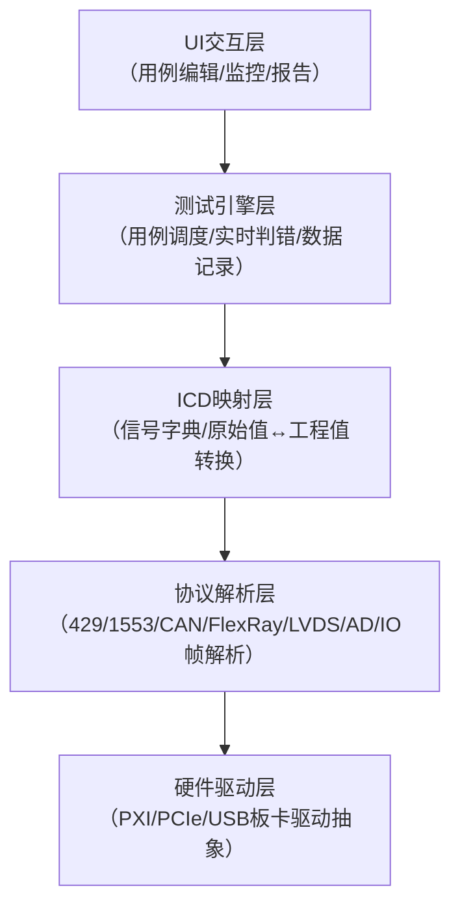

# 要干嘛

```txt
工业控制与航空电子领域确实存在能统一覆盖 IO/AD/ARINC429/RS422/CAN/FlexRay/LVDS/1553B 的集成自动测试框架，主流有ETest、ESITest、UTP，外加LabVIEW+IVI / 总线插件与定制化 ATS两条路线。

1. ETest（凯云科技，航空 / 工控主流）
覆盖接口：DI/DO/AI/AO (AD/DA)、RS232/422/485、1553B、ARINC429、CAN、FlexRay、LVDS、SPI/I²C、以太网。
核心能力：黑盒测试、协议仿真、时序测试、实时内核（≤1ms 响应）、Lua/Python 脚本、用例图形化编辑、报告自动生成。
典型场景：航空电子、车载控制、PLC、轨交、武器装备。
2. ESITest（嵌入式自动化测试工具）
覆盖接口：RS232/422/485、1553B、CAN、TCP/UDP、AD/DA/DI/DO、ARINC429、FlexRay、SPI/I²C、LVDS。
核心能力：可视化建模、DPD 协议语言、实时数据监控、多线程时序测试、数据统计分析、可扩展硬件接口。
3. UTP（宏控软件，工业 / 汽车电子）
覆盖接口：RS232/422/485、CAN/CAN FD、LIN、USB、以太网、ARINC429、ARINC825、1553B、LVDS、DIO、PWM、模拟量 (AD/DA)。
核心能力：嵌入式 / 总线 / 信号测试、模块 / 整机测试、视觉 / 运动控制集成、仪器程控（示波器 / 电源 / 频谱仪）、产线自动化。
```

## 怎么做

把 ICD 定义 → 自动映射成物理意义（静压、总压、高度、空速……），并基于业务含义做自动测试。
下面我用最落地、工程化的方式给你讲清楚：怎么做、用什么工具、实际项目里怎么落地。

```txt
一、核心思路：三层解耦 + ICD 映射
所有成熟方案都遵循同一套架构：
物理层：IO、AD、429、1553B、CAN、FlexRay、LVDS、RS422…
总线协议层：429 字格式、1553B 字、CAN 信号、报文 ID、周期…
ICD 信号层：把原始数据 → 映射为工程量
符号位 → 量程
LSB → 分辨率
偏移量 → 工程值
状态位 → 告警 / 模式 / 状态字
你要的 “ICD 映射”，就是在 第 2 层 → 第 3 层 这件事，做成可配置、可导入、可自动解析，而不是写死代码。

二、真正支持 “ICD 映射 + 全总线统一测试” 的成熟方案

1. 凯云 ETest / TestCenter（国内最主流）
完全为你这种场景设计：
支持导入 Excel/XML/JSON 格式 ICD
自动解析：
429 字符格式、SDI、SSM、奇偶校验
1553B BC/RT/MT 消息块
CAN/FlexRay 信号（DBC/ARXML）
AD 采集量程、校准系数
自动生成：
原始值 ↔ 工程值（静压、总压、攻角、油压……）
按信号名编写测试用例，而不是按通道
测试逻辑直接写：
空速 > 300 → 告警位应置位
静压突变 → 检查是否限幅 / 滤波
这就是你要的：基于 ICD 业务含义测试，而非底层协议。

2. 航电 / 军工通用：ATS 架构 + ICD 数据库
典型架构：
PXI/PXIe 机箱 + 各种总线板卡（429/1553/CAN/FlexRay/IO/AD）
上层统一 信号字典（Signal Dictionary）
ICD 通过配置工具导入，生成信号表
测试脚本只调用信号名：
Altitude = ReadSignal("BaroAltitude")
底层怎么解析、哪个通道、哪个字、哪几位，全部由 ICD 映射自动完成。

3. 汽车行业：Vector 工具链（CAN/LV/FlexRay）+ 扩展到航电
CANoe/CANape 支持 DBC、ARXML、LDF 等信号映射
搭配 429/1553 硬件（AIM、Excalibur、UEI）
可以做统一信号模型
适合：车机 + 航电混合测试场景
4. NI VeriStand（真正的 “信号抽象” 平台）
NI 这套就是为你这种需求设计的：
硬件：PXI 全覆盖（429/1553/CAN/AD/IO/LVDS）
核心：通道映射 + 信号标定
可以导入 ICD，定义：
原始值 → 工程量转换
量程、报警、限幅、校验
按信号名称做测试、告警、闭环
支持实时硬件闭环，同步精度非常高
它本质就是：把所有总线都抽象成 “信号”，ICD 负责翻译。
5. 自研型：Python/Qt 搭建 ICD 解析引擎
很多所里 / 企业自己做：
用 Excel 管理 ICD
写解析器自动生成解析代码
底层驱动封装：429、1553、CAN、AD、IO
上层统一信号接口：
get_signal("Pt") set_signal("FlapControl", 1)
优点：完全贴合项目；缺点：开发维护成本高。
```

三、ICD 映射到底长什么样（给你看实际格式）
以 ARINC429 为例，ICD 一般这样定义：

```txt
信号名：总压 Pt
总线：ARINC429 CH1
标签：010
SDI：00
位数：11
符号：补码
LSB：4 Pa
偏移：0
量程：0 ~ 80000 Pa
单位：Pa
刷新周期：50ms
```

工具导入后，自动实现：

```txt
原始码值 → 自动计算 Pt = Code × LSB + Offset
```

测试用例直接写：

```txt
当 Pt > 70000 时，超限告警应置1
```

这就是你想要的：脱离底层，直接测业务含义。

四、最关键结论（直接给你答案）
在工业控制 + 航电领域，确实存在统一测试框架，
它不仅支持所有总线，还支持 ICD 映射，直接对 “空速、静压、高度” 等工程信号做自动测试。
国内最成熟、落地最多的是：
ETest / TestCenter（凯云）
国际主流是：
NI VeriStand + PXI 硬件
Vector CANoe + 航电扩展板卡
三者都能做到：
统一管理所有 IO/AD/429/1553/CAN/FlexRay/LVDS/RS422
导入 ICD → 自动映射为工程信号
基于信号名编写自动测试用例
自动判权、自动生成报告

## 有的人做了些什么？

一、产线首选：凯云 ETest（国产、全覆盖、ICD 强支持）

1. 核心匹配点（完全贴合你的需求）
总线全覆盖：DI/DO/AI/AO(AD/DA)、RS422、CAN、FlexRay、LVDS、1553B、ARINC429
✅ ICD 映射（产线最关键）：
直接导入 Excel/XML/JSON 格式 ICD（航电标准）
自动解析 429 标签 / SDI/SSM、1553B 消息、CAN 信号、AD 量程
原始值↔工程值自动换算（静压、总压、空速、高度…）
测试用例直接写信号名（如Pt>70000Pa），不用管底层通道
✅ 产线能力：
图形化用例 + Python 脚本，产线工人易上手
批量执行、自动判错、报告自动生成（PDF/HTML/Excel）
支持麒麟 / 统信国产 OS、龙芯 / 飞腾 CPU，100% 国产化
实时响应≤1ms，同步抖动 < 10μs，满足产线节拍
2. ICD 映射在产线的实际用法（一步到位）
准备 ICD：按航电标准整理 Excel（信号名、总线、标签 / ID、位数、LSB、偏移、量程、单位）。
导入 ETest：在 “ICD 管理” 直接导入，自动生成信号字典（静压 P0、总压 Pt、空速 TAS…）。
硬件绑定：信号字典→绑定到 PXI/VPX 总线板卡（429/1553/CAN/AD），底层通道完全透明。
编写用例：直接拖拽信号名，写业务逻辑（如 “空速> 300→告警位 = 1”）。
产线执行：一键批量测试，自动对比 ICD 量程 / 阈值，Pass/Fail 自动判定。
3. 产线硬件推荐（国产 PXIe，全覆盖）
机箱：国产 PXIe 8 槽 / 12 槽（如凯云 / 研华）
板卡（全国产）：
ARINC429：2 通道 / 4 通道，支持标签过滤
1553B：BC/RT/MT，双冗余
CAN/CAN FD：2 通道，支持 DBC
FlexRay：2 通道
LVDS：高速串口 / 图像采集
RS422/485：4 通道
AD/DA：16 位，32 通道
DI/DO：隔离型，64 通道
优势：ETest直接识别板卡，无需额外驱动，即插即用。

二、备选国产工具（产线可用，ICD 支持略弱）

1. 灵思创奇 TestBench
支持 ICD 导入（Excel/XML），可映射 429/1553/CAN/AD。
产线优势：用例拖拽 + Python，报告模板自定义，权限管理严格。
劣势：FlexRay/LVDS 支持较弱，需额外开发插件。
2. 世冠科技 GCAir
航电 ICD 管理强，支持 429/1553/CAN 总线映射。
产线优势：系统架构可视化，支持分布式测试。
劣势：AD/DA/IO 支持一般，产线节拍优化不足。

## 自己做怎么做？

自研一套类似 ETest 的产线级全总线 ICD 自动测试平台，是一个硬件驱动 + 协议栈 + 实时引擎 + ICD 映射 + UI 交互的复杂系统工程。下面我从架构设计、核心模块、技术选型、落地步骤四个维度给你一套可执行的方案。
一、整体架构设计（分层解耦，参考 ETest）
自研平台必须遵循 **“硬件抽象→协议解析→ICD 映射→测试引擎→UI 交互”** 的五层架构，确保每一层可独立扩展：



二、核心模块实现（逐个拆解，抓重点）

1. 硬件驱动层：统一抽象，兼容多厂商板卡
这是最底层、最耗时的部分，需解决 “不同厂商板卡 API 不同” 的问题：
方案：设计统一硬件抽象层（HAL），定义标准接口（如OpenDevice()、ReadFrame()、WriteFrame()），各厂商板卡通过适配器对接。
技术：
用 C/C++ 编写驱动适配层（性能最优）。
对接主流板卡厂商 SDK：
航电：AIM、Excalibur、Sital（429/1553B）。
车载：Vector、PEAK-System（CAN/CAN FD/FlexRay）。
工业：NI、研华、凯云（PXIe/AD/DA/IO）。
产线要求：支持热插拔、多卡同步（硬件触发总线 / PTP IEEE1588）。
2. 协议解析层：实现全总线帧格式解析
需覆盖你提到的所有总线，核心是 “把原始字节流解析成结构化字段”：
ARINC429：解析标签（Label）、SDI、数据位、SSM、奇偶校验。
1553B：解析命令字、数据字、状态字，支持 BC/RT/MT 模式。
CAN/CAN FD：解析 CAN ID、DLC、数据场，支持 DBC 文件导入。
FlexRay：解析帧 ID、周期、数据段，支持 ARXML 导入。
AD/DA/IO：处理采样率、量程、校准系数、数字量输入输出。
技术：用 C/C++ 写协议解析核心（性能优先），Python 做辅助封装。
3. ICD 映射层：核心中的核心，实现 “原始值→工程值” 自动转换
这是你最关心的部分，需设计信号字典（Signal Dictionary） 存储 ICD 信息：
ICD 数据结构设计（SQLite/MySQL 存储）：

字段名 说明 示例
SignalName 信号名 总压 Pt
BusType 总线类型 ARINC429
Channel 通道号 CH1
Label/ID 标签 / 帧 ID 010
BitStart/BitEnd 起始 / 结束位 11-29
DataType 数据类型 补码 / BNR/BCD
LSB 最小分辨率 4 Pa
Offset 偏移量 0
RangeMin/RangeMax 量程范围 0~80000 Pa
Unit 单位 Pa

转换公式实现:
补码 / BNR 转工程值：EngineeringValue = RawValue × LSB + Offset
BCD 转十进制：直接按位解析。
状态位解析：单独映射告警 / 模式 / 故障位。
ICD 导入功能：支持 Excel/XML/JSON 解析（用 Python 的pandas/xml.etree库）。

1. 测试引擎层：产线自动化的核心
需满足实时执行、自动判错、数据记录三大产线需求：
用例编辑：
图形化：拖拽信号名、条件判断（如Pt>70000Pa）、延时、循环。
脚本化：嵌入 Python/Lua 脚本，支持复杂逻辑（如if Altitude>10000 then CheckAlarm(1)）。
实时调度：
产线要求 **≤1ms 响应**，需用实时操作系统（RTOS） 或 Windows 实时扩展（如 RTX/INtime）。
支持多线程并行：同步采集多总线数据，互不阻塞。
自动判错：
对比 ICD 量程（如Pt<0 or Pt>80000 → Fail）。
状态位校验（如AlarmBit=1 → 记录故障码）。
时序校验（如429帧周期应在50ms±5ms）。
数据记录与报告：
实时存储原始数据 + 工程值（用 SQLite/CSV）。
自动生成 PDF/HTML/Excel 报告（用 Python 的ReportLab/Jinja2库）。
2. UI 交互层：产线工人易上手
需简洁、直观、权限可控：
技术选型：
桌面端：Qt（C++/Python）（性能最优，跨平台）。
Web 端：Vue.js/React + Electron（方便远程访问，适合多工位）。
核心界面：
ICD 管理：导入 / 编辑 / 导出信号字典。
用例编辑：图形化拖拽 + 脚本编辑。
产线执行：一键启动、实时监控（信号波形 / 状态灯）、Pass/Fail 弹窗提示。
报告查询：按批次 / 时间 / 产品序列号检索。
产线优化：
支持扫码枪（输入产品序列号，自动加载对应 ICD 和用例）。
权限管理：管理员（编辑 ICD / 用例）、工人（仅执行测试）。

三、技术选型清单（直接给结论，少走弯路）
模块 技术选型 理由
硬件驱动 / 协议解析 C/C++ 性能最优，对接厂商 SDK 方便
ICD 映射 / 测试引擎 / 报告 Python 开发效率高，库丰富（pandas/ReportLab）
UI Qt（PySide6/PyQt6） 跨平台，性能好，适合工业桌面端
数据库 SQLite（轻量）/MySQL（多工位） SQLite 适合单机，MySQL 适合产线多工位协同
实时性 RTOS（如 VxWorks/RT-Linux）或 Windows RTX 满足产线≤1ms 响应要求
版本控制 Git 管理代码和 ICD 版本

四、落地步骤（分阶段迭代，1 个月出 MVP）
阶段 1：MVP 验证（1 个月，先做核心功能）
目标：验证 “硬件驱动→协议解析→ICD 映射→简单测试” 链路。
功能：
支持 1-2 种总线（如 ARINC429+CAN）。
简单 Excel ICD 导入，实现原始值→工程值转换。
基础 UI：信号监控、手动测试、简单报告。
硬件：买 1 块 ARINC429 板卡 + 1 块 CAN 板卡（如 AIM/PEAK）。
阶段 2：产线可用（3-6 个月，扩展功能）
目标：覆盖全总线，实现产线自动化。
功能：
扩展所有总线（1553B/FlexRay/LVDS/AD/DA/IO）。
图形化用例编辑、自动判错、批量执行。
产线优化：扫码枪、权限管理、多工位协同。
硬件：搭建 PXIe 机箱 + 全总线板卡测试台。
阶段 3：优化完善（6-12 个月，提升稳定性）
目标：达到 ETest 的产线级稳定性。
功能：
实时性优化（≤1ms 响应）。
硬件兼容性提升（对接更多厂商板卡）。
性能优化（支持 100 + 通道并行采集）。
五、自研的风险与建议（非常重要，先看）

1. 风险
周期长：ETest 团队有 10 + 年积累，自研至少需 1-2 年才能达到产线级稳定。
成本高：需投入硬件（板卡 / 测试台）+ 软件团队（驱动 / 协议 / UI / 测试），成本远超采购 ETest。
硬件兼容性坑多：不同厂商板卡 API 差异大，驱动适配需大量调试。
实时性难保证：产线≤1ms 响应需深厚的实时系统开发经验。
2. 建议
优先采购成熟产品：ETest 已满足你需求，采购成本远低于自研，且有售后支持（驻场培训 / 迁移）。
若必须自研：
先做MVP 验证（阶段 1），确认可行性再投入。
挖有航电 / 车载测试平台开发经验的人（核心团队至少 3-5 人）。
部分模块可开源替代：
协议解析：用libpcap（抓包）、cantools（CAN DBC 解析）。
UI：用 Qt 开源版。
数据库：SQLite/MySQL 开源。

六、总结
自研类似 ETest 的平台技术可行，但周期长、成本高、风险大。
若时间紧、预算有限：直接采购 ETest，1 周内可上线产线。
若有长期技术积累需求、团队充足：按上述架构分阶段迭代，1 个月出 MVP，1-2 年达到产线级稳定。
需要我帮你细化MVP 阶段的具体代码框架（如硬件抽象层接口定义、ICD 数据结构、Qt UI 示例）吗？
