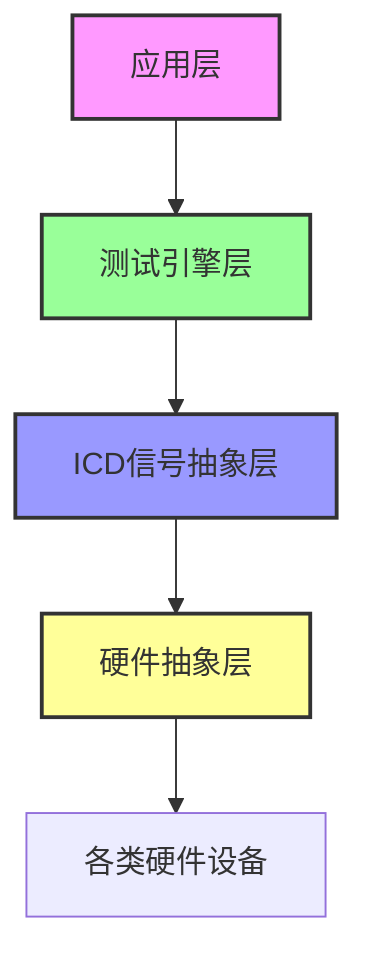
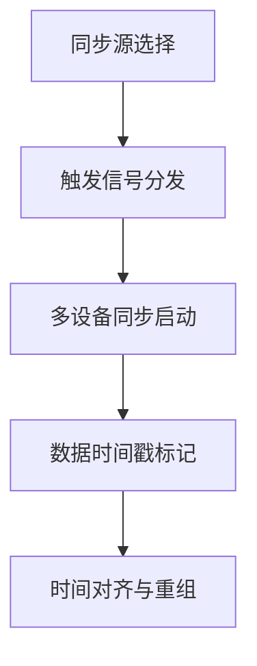

# 测控领域综合性测试平台技术方案

## 一、方案概述
### 1.1 建设目标
打造一套**全硬件兼容、高可靠、易扩展**的统一测试平台，实现对现有所有测试硬件的集中管理和自动化测试，提升测试效率，保障测试数据准确性和可追溯性。

### 1.2 支持的硬件范围
平台全面覆盖现有各类测试硬件，无需对现有硬件做任何改动：
| 硬件类别 | 具体支持范围                                     | 适配方式        |
| -------- | ------------------------------------------------ | --------------- |
| 采集卡   | AD、DA、IO                                       | 对接指定厂商SDK |
| 工业总线 | RS232/422/485、CAN、A429、1553B、Flexray、TCP/IP | 对接指定厂商SDK |
| 通用仪器 | 电源、示波器、万用表等VISA标准仪器               | 标准VISA库对接  |

---

## 二、整体架构设计
### 2.1 四层松耦合架构


各层核心能力：
1. **硬件抽象层**：统一插件接口，屏蔽各类硬件的操作差异，实现硬件的即插即用
2. **ICD信号抽象层**：将硬件通道/数据字段转换为标准化的工程信号，测试人员只需关心信号值，无需了解硬件细节
3. **测试引擎层**：负责测试用例的自动化调度执行，支持复杂流程控制和脚本扩展
4. **应用层**：提供可视化操作界面，实现设备管理、用例编辑、测试监控、报告生成全流程功能

### 2.2 核心设计优势
#### ✅ 全硬件兼容
- 插件化驱动设计，所有硬件均通过标准化插件接入
- 现有指定厂商硬件和VISA标准仪器均可完美适配，无需改动硬件配置
- 新增硬件仅需开发对应插件，平均2周即可完成适配

#### ✅ 高实时性高可靠性
- 采用工业级异步多线程架构，满足1-10ms级信号采集控制需求
- 硬件连接异常自动重连，测试数据实时落盘，确保数据不丢失
- 7*24小时稳定运行，异常情况自动保护硬件设备安全

#### ✅ 数据安全可追溯
- 全链路数据校验，采集数据、测试结果全程不可篡改
- 测试数据自动持久化存储，支持全生命周期追溯
- 支持数据备份、恢复、导出，满足合规性要求

#### ✅ 开放可扩展
- 标准化插件接口，支持用户自定义扩展硬件和功能
- 支持Python/Lua/JavaScript多脚本扩展，满足复杂测试场景需求
- 提供开放API，支持与现有测试管理系统对接

---

## 三、核心模块设计思路
### 3.1 硬件插件模块（类比：标准化板卡插槽）
#### 设计思路
采用**标准化插件接口**设计，类似于工业测控机箱的CPCI/PXI插槽：
- 定义统一的硬件驱动插件规范，所有硬件驱动都按照这个规范开发
- 插件管理器相当于"机箱背板"，负责所有插件的识别、加载、供电（资源分配）
- 不同类型硬件（采集卡/总线/仪器）在统一接口基础上扩展专用功能，类似于不同功能的板卡插入相同插槽

#### 设计优势
✅ **即插即用**：新硬件只需要开发符合规范的驱动插件，插入系统即可识别使用  
✅ **互不干扰**：各插件独立运行，单个硬件驱动异常不会影响整个系统稳定  
✅ **兼容现有硬件**：指定厂商驱动和VISA仪器驱动都可以封装成标准插件，无需改动现有硬件配置

### 3.1.1 硬件自动识别流程（类比：PCIe设备枚举）
系统识别硬件的过程和计算机上电识别PCIe板卡的流程完全一致，分为4步：


**步骤说明**：
1. **总线扫描**：系统启动时自动扫描所有硬件接口（PCIe/USB/网口/GPIB等），就像BIOS扫描PCIe总线
2. **ID识别**：读取硬件的唯一标识信息（厂商ID、设备ID、序列号等），相当于读取板卡的EEPROM信息
3. **插件匹配**：根据硬件ID在插件库中查找对应的驱动插件，和"设备ID→驱动"的匹配逻辑一样
4. **初始化验证**：加载插件后与硬件进行握手验证，确认硬件功能正常，相当于驱动初始化和自检
5. **状态管理**：硬件上线后持续监控工作状态，异常自动告警和重连

### 3.1.2 各类硬件的适配方式
#### 1. 采集卡/板卡类硬件（AD/DA/IO）
- **适配方式**：基于厂商官方SDK封装成标准插件
- **识别过程**：
  1. 扫描PCIe/USB总线，读取板卡的VID/PID（厂商ID/设备ID）
  2. 根据VID/PID匹配对应的厂商SDK插件
  3. 调用SDK接口初始化板卡，读取通道数、采样率等硬件参数
  4. 进行功能自检（AD自校验、DO回读等），验证硬件正常
- **优势**：完全基于厂商官方SDK开发，兼容性100%，功能和原厂软件完全一致

#### 2. 总线类硬件（CAN/1553B/429/Flexray/串口）
- **适配方式**：基于厂商SDK或标准协议库封装插件
- **识别过程**：
  1. 扫描对应的总线接口（PCIe/CAN卡、串口等）
  2. 读取硬件ID匹配对应插件
  3. 配置总线参数（波特率、终端电阻、ID过滤等）
  4. 进行总线通信测试，验证收发功能正常
- **优势**：统一的总线操作接口，上层应用不需要关心具体总线类型

#### 3. VISA仪器类（电源/示波器/万用表等）
- **适配方式**：基于标准VISA库封装通用插件
- **识别过程**：
  1. 扫描所有VISA总线（USB/GPIB/LAN/RS232）
  2. 读取仪器的*IDN?信息（厂商、型号、序列号）
  3. 根据仪器型号匹配对应的驱动插件（或使用通用SCPI插件）
  4. 发送标准SCPI命令验证通信和功能正常
- **优势**：支持所有符合VISA标准的仪器，新增仪器不需要重新开发插件，只需配置SCPI命令集

### 3.1.3 硬件状态管理（类比：板卡状态寄存器）
系统对所有硬件进行全生命周期状态管理，就像硬件的状态寄存器：
- **离线**：硬件未连接或未识别
- **已识别**：硬件已识别，等待加载驱动
- **初始化中**：驱动加载中，正在进行自检
- **正常运行**：硬件工作正常，可以正常使用
- **异常告警**：硬件出现可恢复异常（如缓存溢出、通信超时）
- **故障离线**：硬件出现不可恢复故障，自动离线

硬件状态实时显示在界面上，异常时自动记录日志并告警，支持手动复位和自动重连。

### 3.1.4 Qt插件机制与跨平台封装（类比：标准化IP核设计）
本方案采用工业级Qt框架的标准化插件机制，其设计思想和FPGA的**可配置IP核**完全一致：
- 统一的接口标准：相当于IP核的标准引脚定义，所有插件都遵循相同的接口规范
- 动态加载机制：相当于IP核的动态重配置，插件可以在系统运行时加载/卸载，不需要重启整个系统
- 跨平台兼容：相当于同一IP核可以在不同系列的FPGA上使用，插件可以在Windows/Linux等不同操作系统下运行

#### 跨平台封装厂商SDK的实现原理
采用三层隔离架构，完全隔离平台差异和厂商SDK差异：
```mermaid
graph TD
    A[核心平台层<br/>(Qt实现，100%跨平台)] --> B[插件接口层<br/>(标准化接口，全平台统一)]
    B --> C[插件适配层<br/>(隔离平台/SDK差异)]
    C --> D[厂商SDK层<br/>(原厂提供的对应平台SDK)]
    D --> E[硬件设备]
    
    style A fill:#f9f,stroke:#333,stroke-width:2px
    style B fill:#9f9,stroke:#333,stroke-width:2px
    style C fill:#99f,stroke:#333,stroke-width:2px
    style D fill:#ff9,stroke:#333,stroke-width:2px
```

**各层说明**：
1. **核心平台层**：基于Qt实现的主程序框架，Qt本身已经实现了操作系统级别的跨平台封装，相同代码可以在Windows/Linux等不同系统下编译运行，无需修改。
2. **插件接口层**：标准化的插件接口定义，所有硬件插件都必须遵循这个接口，相当于硬件的"背板总线标准"，全平台统一，不随操作系统和硬件类型变化。
3. **插件适配层**：这是唯一和平台/SDK相关的部分，负责将厂商SDK的非标准接口转换为系统的标准接口，相当于"总线转接板"。不同厂商、不同平台的SDK差异全部在这一层隔离。
4. **厂商SDK层**：直接使用硬件厂商提供的官方SDK，完全保留原厂SDK的功能和稳定性，我们不做任何修改，只做接口转换。

#### 跨平台封装的优势
✅ **核心平台无修改**：跨平台适配只需要修改插件适配层，核心平台代码100%不变，稳定性有保障  
✅ **SDK原汁原味**：完全使用厂商官方SDK，硬件功能和原厂软件完全一致，不会出现兼容性问题  
✅ **跨平台迁移成本低**：从Windows迁移到Linux系统，只需要重新编译各硬件的插件适配层，核心平台和测试用例完全不需要修改  
✅ **同类型硬件通用**：不同厂商的同类型硬件（如不同厂商的CAN卡）可以使用相同的上层接口，更换硬件不需要修改测试逻辑  

Qt插件机制已经在工业控制、测控仪器领域有超过10年的大规模应用验证，是非常成熟稳定的技术方案。

### 3.1.5 多设备同步采集机制（类比：PXI同步触发总线）
系统支持多板卡、多设备的精确同步采集，同步机制和PXI机箱的10MHz同步时钟+触发总线原理完全一致：


#### 两种同步模式，覆盖不同场景需求
##### 1. 硬件触发同步（同步精度<1μs，适用于高精度同步场景）
- **原理**：通过外部硬件触发线连接所有设备的同步触发端口，主设备输出触发信号，所有从设备同时接收到触发信号后同步启动采集
- **配置方式**：可视化选择哪个设备作为主触发源，触发信号类型（边沿触发/电平触发），触发阈值
- **适用场景**：多AD卡同步采集、高速瞬态信号采集、动力系统闭环测试等对同步精度要求极高的场景

##### 2. 软件时间戳同步（同步精度<1ms，适用于一般测试场景）
- **原理**：所有设备的采集数据都由系统统一标记高精度时间戳（微秒级），数据上传后根据时间戳自动对齐重组
- **时钟校准**：系统启动时自动校准所有设备的本地时钟，保证时钟偏差<100μs
- **适用场景**：慢变信号采集、环境试验、性能测试等对同步精度要求不极端的场景

#### 同步采集的设计优势
✅ **配置灵活**：根据项目需求选择合适的同步方式，不需要改动硬件接线即可切换  
✅ **自动对齐**：所有同步采集的数据自动按时间戳重组，不需要人工做数据对齐  
✅ **设备无关**：同步机制对上层透明，更换设备不需要修改同步相关的测试逻辑  
✅ **可扩展**：支持最多16台设备的同步采集，满足大型测试系统需求

### 3.2 ICD信号转换模块（类比：信号调理电路）
#### 设计思路
采用**分层信号处理**架构，类似于硬件的信号调理电路：
```
原始硬件数据 → 采集缓存 → 信号解析 → 单位转换 → 工程值输出
```
- 第一层：对接硬件原始数据（AD采样值、总线报文、仪器返回值）
- 第二层：按照ICD配置的映射关系，从原始数据中提取对应字段
- 第三层：根据转换规则（线性缩放、多项式拟合、枚举映射、自定义算法）转换为工程值
- 第四层：加上时间戳、质量标记后输出到信号总线

#### 设计优势
✅ **硬件透明**：上层应用只需要处理标准工程信号，不需要关心硬件数据格式  
✅ **转换灵活**：支持各种复杂的信号转换需求，类似于硬件可配置的信号调理模块  
✅ **可追溯**：所有信号都带时间戳和质量标记，可回溯到原始采集数据

### 3.2.1 ICD与硬件的映射机制（类比：可配置协议解析器+信号路由矩阵）
ICD信号与硬件的映射过程，相当于**硬件协议解析芯片+信号路由矩阵**的功能：根据配置规则，自动从硬件的原始数据流中提取对应字段，转换为标准化信号；输出时反过来，将信号值打包到硬件报文的对应位置。

#### 映射关系建立流程（可视化配置，无需代码）


所有配置完全通过可视化界面完成，不需要编写任何代码，测试人员可以自行修改映射关系。

### 3.2.2 不同类型硬件的映射方式
#### 1. 采集卡/IO类硬件（AD/DA/DIO）
**映射方式**：直接关联到物理通道号
- **采集输入（AD/DI）**：ICD信号直接关联到AD的通道号、DI的通道号，系统自动从对应通道读取采样值
- **控制输出（DA/DO）**：信号值直接输出到对应的DA通道、DO通道
- **例子**：
  > 信号"供电电压" → 关联到AD模块的第3通道 → 自动采集CH3的采样值 → 转换为电压工程值
  > 信号"继电器控制" → 关联到DIO模块的第5输出通道 → 信号值为1时DO5输出高电平

#### 2. 总线类硬件（CAN/1553B/429/串口等）
**映射方式**：关联到总线报文的具体字段位置
- **接收信号**：配置对应报文的ID、字段在报文中的偏移量（第几个字节、第几位）、数据长度、字节序
- **发送信号**：配置信号值打包到对应报文的对应位置
- **例子（CAN总线）**：
  > 信号"电机温度" → 关联到CAN ID=0x123的报文 → 偏移量为第2个字节开始的2个字节 → 数据类型为无符号短整型 → 转换为温度工程值
  > 系统收到0x123的CAN报文时，自动提取第2-3字节的数值，转换为温度信号值发布

#### 3. VISA仪器类硬件（电源/示波器/万用表等）
**映射方式**：关联到SCPI命令的返回值字段
- **测量信号**：配置对应的SCPI查询命令（如`MEAS:VOLT:DC?`），以及返回值的解析规则
- **控制信号**：配置对应的SCPI设置命令（如`VOLT {value}`），信号值自动替换到命令的对应位置
- **例子（可编程电源）**：
  > 信号"输出电压" → 关联到SCPI命令`MEAS:VOLT?`的返回值 → 直接转换为电压值
  > 信号"设置电压" → 关联到SCPI命令`VOLT {value}` → 信号值更新时自动发送命令设置电源输出

### 3.2.3 字段定位与转换规则
#### 字段定位能力（支持所有常见数据格式）
- **位级定位**：支持精确到某个位的提取（如DI状态、故障标志位）
- **字节级定位**：支持任意字节偏移、任意长度的字段提取
- **数据类型支持**：支持有符号/无符号整数、浮点数、ASCII字符串、BCD码等所有常见数据类型
- **字节序支持**：支持大端/小端/自定义字节序的转换

#### 转换规则配置（覆盖所有测控场景）
1. **线性转换**：`工程值 = 原始值 * 系数 + 偏移量`，用于AD采样值转电压、电流等
   > 例子：16位AD原始值范围0-65535，对应电压范围-10V~+10V，配置系数=20/65535，偏移量=-10
2. **多项式转换**：支持高阶多项式拟合，用于传感器非线性校准
   > 例子：热电偶电压转温度，用3阶多项式拟合校准曲线
3. **枚举映射**：原始值与状态的一一映射，用于状态量解析
   > 例子：原始值0=待机，1=运行，2=故障，3=告警
4. **自定义脚本转换**：复杂转换逻辑可以用简单脚本实现，无需修改系统代码
   > 例子：根据压力和温度计算气体密度、多字段组合计算等

### 3.2.4 映射机制的核心优势
✅ **硬件变更不影响测试逻辑**：硬件通道调整、报文格式修改时，只需要修改ICD映射配置，所有测试用例完全不需要修改，大幅降低硬件迭代带来的测试维护成本
✅ **信号复用性高**：同一信号可以同时来自不同硬件（如真实硬件和仿真器），只需要切换映射关系，测试逻辑不变
✅ **配置可导出导入**：ICD配置可以导出为标准文件，多个测试工位可以复用同一配置，保证测试一致性
✅ **自动校验**：系统自动校验映射关系的合法性，避免配置错误导致的数据异常

### 3.3 测试执行引擎（类比：状态机控制器）
#### 3.3.1 测试用例与ICD信号的关联机制（类比：测试夹具的信号连接）
测试用例和ICD信号的关联设计，类似于**被测板→测试夹具→测试仪器**的连接关系：
- ICD信号相当于测试夹具上的标准测试点，所有测试点都有唯一的信号名
- 测试用例相当于标准化的测试程序，只需要指定要操作的测试点名称，不需要关心测试点连接到哪台仪器的哪个通道
- 关联关系就是"测试点→仪器通道"的连接关系，由ICD配置统一管理

#### 关联方式：信号名一一对应，无需硬编码
测试用例中所有信号操作都只使用**逻辑信号名**（ICD中定义的信号名），和硬件完全解耦：
```mermaid
graph LR
    A[测试用例<br/>(逻辑信号名)] --> B[ICD信号映射表]
    B --> C[硬件1通道N]
    B --> D[硬件2报文X字段Y]
    B --> E[硬件3SCPI命令Z]
```

**实际例子**：
> 测试用例中定义："检查供电电压是否在11.5V~12.5V范围内"
> 这里的"供电电压"就是ICD中定义的逻辑信号名，它可以根据实际测试环境映射到：
> - 研发环境：映射到AD板卡的第3通道
> - 生产环境：映射到电源分析仪的第1通道
> - 仿真环境：映射到仿真模型输出的电压变量
> 
> 测试用例本身完全不需要修改，只需要调整ICD的映射配置即可在不同环境下运行。

#### 关联关系的核心优势
✅ **测试用例100%复用**：同一测试用例可以在研发、生产、运维等不同场景下复用，不需要重新编写  
✅ **硬件变更零成本**：硬件通道调整、设备更换时，只需要修改ICD映射配置，所有测试用例完全不用改动  
✅ **跨平台移植**：测试用例可以在不同测试工位、不同测试系统之间共享，形成测试用例库  
✅ **逻辑清晰**：测试用例只描述测试逻辑，没有硬件相关的底层操作，可读性和可维护性大幅提升

#### 设计思路
采用**多线程状态机**架构，类似于硬件的时序控制器：
- 测试用例相当于"硬件时序配置表"，定义了每个步骤的操作、判断条件、跳转规则
- 执行引擎相当于"CPU控制器"，按照配置表顺序执行，支持分支、循环、跳转等逻辑
- 多个测试用例可以并行执行，相当于"多核CPU"同时处理多个任务
- 内置异常处理机制，相当于硬件的"看门狗"，异常情况自动进入保护模式

#### 设计优势
✅ **实时性保障**：高优先级线程处理采集控制，确保1-10ms响应要求  
✅ **稳定可靠**：异常自动处理，不会因为测试逻辑错误导致系统崩溃或硬件损坏  
✅ **灵活扩展**：支持复杂流程控制，满足各种测试场景需求

### 3.4 数据存储模块（类比：非易失性存储+校验）
#### 设计思路
采用**三级存储**架构，类似于硬件的"寄存器→内存→Flash"存储机制：
1. **实时缓存层**：最近的信号数据存在内存缓存，支持高速查询和实时显示
2. **实时落盘层**：所有数据立即写入本地SQLite数据库，确保掉电不丢失
3. **备份层**：定期自动备份数据到异地存储，支持数据恢复

数据写入全程带校验：
- 每笔数据写入时计算校验和，读取时自动校验
- 异常中断后启动自动校验修复机制，确保数据完整性

#### 设计优势
✅ **数据零丢失**：三级存储+实时落盘，即使突然断电也不会丢失数据  
✅ **完整性保障**：全链路校验，确保数据不会被篡改或损坏  
✅ **查询高效**：支持按时间、按信号、按测试项目快速查询历史数据

---

## 四、核心功能特性
### 3.1 硬件设备管理
- **自动识别**：自动扫描识别所有已连接的硬件设备，支持热插拔
- **统一配置**：可视化界面完成所有硬件的参数配置、状态监控
- **连接管理**：自动管理硬件连接生命周期，异常自动重连
- **模拟功能**：内置虚拟设备模拟器，支持离线开发测试用例

### 3.2 ICD信号管理
- **信号建模**：可视化定义信号的工程属性（量程、单位、告警阈值等）
- **映射配置**：灵活配置信号与硬件通道/数据字段的映射关系
- **自动转换**：支持线性、多项式、枚举、脚本等多种转换方式，自动完成原始值到工程值的双向转换
- **信号分组**：支持按系统、按功能、按设备对信号进行分组管理

### 3.3 自动化测试引擎
- **可视化编辑**：拖拽式编辑测试流程，无需编程即可完成复杂用例设计
- **流程控制**：支持分支判断、循环、并行执行、超时处理、异常处理等复杂逻辑
- **脚本扩展**：支持Python/Lua/JavaScript脚本，满足特殊测试场景需求
- **执行控制**：支持启动、暂停、恢复、终止、断点、单步调试等操作
- **实时监控**：测试过程中实时查看信号值、执行状态、运行日志

### 3.4 测试数据与报告
- **数据记录**：完整记录测试过程中的所有信号数据、执行日志、测试结果
- **报告生成**：自动生成标准化测试报告，支持PDF/Excel/HTML多格式导出
- **历史查询**：支持历史测试结果查询、对比分析、趋势统计
- **数据导出**：原始数据和结果数据支持多种格式导出，方便后续分析

### 3.5 实时数据监控与显示（类比：多通道示波器+数字面板表组合）
实时监控系统的设计完全参照测控领域常用的仪器操作习惯，相当于一台**软件化的多通道综合测试仪**：
```mermaid
graph LR
    A[信号总线<br/>(所有信号实时发布)] --> B[环形数据缓存<br/>(保存最近N分钟数据)]
    B --> C[显示组件]
    C --> D[示波器波形显示]
    C --> E[数字面板显示]
    C --> F[趋势曲线显示]
    C --> G[状态指示灯]
    C --> H[告警判断]
    H --> I[声光告警提示]
```

#### 核心功能特性
##### 1. 多类型数据显示，覆盖所有监控需求
- **示波器模式**：支持多通道波形叠加显示、时间轴缩放、光标测量、参数自动计算（最大值/最小值/平均值/频率等），和真实示波器操作完全一致
- **数字面板模式**：模拟传统指针表、数字面板表显示，支持自定义量程、单位、颜色
- **趋势曲线模式**：长时间运行时显示信号的变化趋势，支持跨天数据查看
- **状态指示模式**：开关量、状态量用指示灯显示，不同状态显示不同颜色（正常=绿色、告警=黄色、故障=红色）

##### 2. 灵活的自定义能力
- **自由布局**：用户可以通过拖拽方式自由调整显示组件的位置、大小，支持多页面切换
- **自定义告警**：每个信号可以独立设置上下限告警阈值，超限自动高亮显示、触发声光告警
- **界面保存**：自定义的监控界面可以保存为模板，不同测试项目可以直接复用

##### 3. 高性能设计，满足高采样率监控需求
- **高刷新率**：最高支持100Hz画面刷新，高速变化信号也能流畅显示
- **低延迟**：从硬件采集信号到屏幕显示的总延迟<100ms，满足实时监控需求
- **大容量支持**：支持同时监控1000+个信号，系统运行流畅不卡顿
- **历史回溯**：缓存最近30分钟的所有信号数据，可以随时暂停查看历史波形，支持回放、导出

#### 设计优势
✅ **操作习惯一致**：和真实仪器操作逻辑一致，测试人员不需要重新学习即可快速上手  
✅ **信号透明**：显示组件只需要订阅信号名，不需要关心信号来源，硬件变更不影响监控界面  
✅ **扩展性好**：支持自定义显示组件，满足特殊的显示需求  
✅ **数据可导出**：监控的波形数据可以直接导出为CSV/Matlab格式，方便后续分析

---

## 五、技术可行性与保障措施
### 4.1 技术路线成熟性
- 基于工业级Qt 5.15 LTS框架开发，跨平台稳定可靠，已在多个工业测控项目中验证
- 插件化架构设计，硬件驱动与核心平台解耦，适配灵活，稳定性高
- 采用标准VISA库对接通用仪器，指定厂商硬件直接对接官方SDK，兼容性有保障

### 4.2 实时性保障
- 硬件采集线程采用高优先级调度，确保采集响应时间<10ms
- 信号总线采用异步无锁设计，支持1000+信号并发流转无延迟
- 测试执行采用多线程调度，不同测试任务互不干扰

### 4.3 可靠性保障
- **数据安全**：采用"内存缓存+实时落盘+双备份"机制，确保测试数据零丢失
- **异常容错**：硬件操作异常自动重试，流程异常自动进入保护模式，不会损坏硬件
- **稳定性测试**：每阶段完成72小时连续运行测试，确保系统稳定可靠

### 4.4 兼容性保障
- 所有硬件驱动插件均基于厂商官方SDK开发，兼容性100%
- 支持硬件多版本SDK共存，无需升级现有硬件驱动
- VISA仪器支持所有符合IVI标准的仪器，无需额外适配

---

## 六、开发计划与里程碑
### 5.1 总体开发周期：6个月，分四阶段交付，可逐阶段验证
| 阶段                             | 时间        | 交付内容                                           | 验证点                                   |
| -------------------------------- | ----------- | -------------------------------------------------- | ---------------------------------------- |
| **第一阶段：核心框架搭建**       | 第1-1.5个月 | 平台核心框架、虚拟设备插件、基础监控界面           | 验证插件架构可行性、基础信号采集功能     |
| **第二阶段：ICD与测试引擎**      | 第1.5-3个月 | ICD信号管理、测试引擎核心、基础用例编辑            | 验证信号抽象功能、基本自动化测试能力     |
| **第三阶段：硬件接入与功能完善** | 第3-4.5个月 | 指定厂商硬件驱动、VISA仪器驱动、脚本支持、报告生成 | 验证所有硬件适配能力、完整自动化测试流程 |
| **第四阶段：优化与验证**         | 第4.5-6个月 | 完整应用界面、性能优化、稳定性测试                 | 全功能验证、72小时连续运行测试           |

### 5.2 关键里程碑节点
- ✅ **第3个月**：可支持基础自动化测试功能，可开始编写测试用例
- ✅ **第4.5个月**：所有硬件适配完成，可接入实际测试环境试用
- ✅ **第6个月**：平台正式上线运行

---

## 七、风险与应对措施
| 风险点            | 影响程度 | 应对措施                                          |
| ----------------- | -------- | ------------------------------------------------- |
| 硬件SDK接口不明确 | 中       | 提前对接厂商获取完整SDK文档和技术支持             |
| 实时性不满足要求  | 中       | 架构设计阶段预留性能优化空间，提前做性能验证      |
| 开发进度滞后      | 低       | 采用敏捷开发模式，每2周交付一个可用版本，及时调整 |
| 数据丢失风险      | 高       | 采用多层数据备份机制，实时落盘+定期备份+异地存储  |

---

## 八、预期收益
1. **测试效率提升70%以上**：自动化测试替代人工操作，大幅缩短测试周期
2. **人员成本降低80%**：测试人员无需掌握复杂硬件操作，只需了解信号定义
3. **测试质量显著提升**：避免人工操作误差，测试结果一致性、准确性大幅提升
4. **数据资产沉淀**：所有测试数据统一管理，支持质量追溯和大数据分析
5. **长期扩展性好**：新增硬件/功能快速适配，保护现有投资
